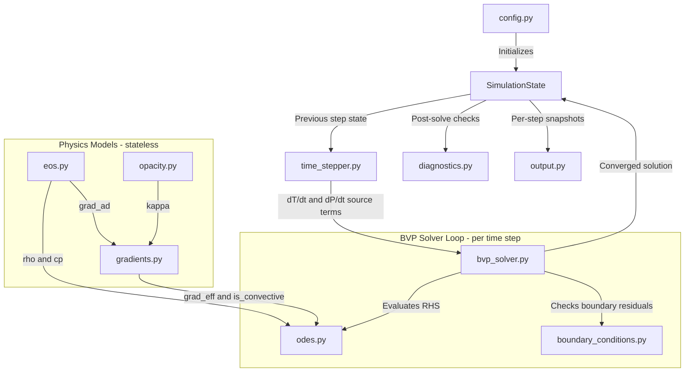

# PlanetFormationSim — Architecture & Development Plan

**Project:** 1D Quasi-Static Planetary Gas Envelope Collapse (Kelvin-Helmholtz Contraction)
**Course:** Computational Physics
**Last Updated:** 2026-07-13

---

## Table of Contents

1. [Physics Overview](#1-physics-overview)
2. [Module Structure](#2-module-structure)
3. [Architecture Data-Flow Diagram](#3-architecture-data-flow-diagram)
4. [Key Design Decisions](#4-key-design-decisions)
5. [Sequential Sub-Tasks Breakdown](#5-sequential-sub-tasks-breakdown)

---

## 1. Physics Overview

### Goal
Simulate the 1D quasi-static spherical collapse of a protoplanetary gas envelope via Kelvin-Helmholtz contraction. No hydrodynamics — only time-evolution of structural (stellar-interior-type) equations on a Lagrangian mass grid.

### Grid
- **Coordinate:** Lagrangian mass coordinate $m$ (mass enclosed within radius $r$)
- **Domain:** $m = 0$ (center) to $m = M_\text{total}$ (surface)

### System of 4 ODEs

| # | Equation | Physical meaning |
|---|---|---|
| 1 | $\dfrac{dr}{dm} = \dfrac{1}{4\pi r^2 \rho}$ | Continuity / mass-radius relation |
| 2 | $\dfrac{dP}{dm} = -\dfrac{Gm}{4\pi r^4}$ | Hydrostatic equilibrium |
| 3 | $\dfrac{dL}{dm} = -c_p \dfrac{\partial T}{\partial t} + \dfrac{1}{\rho}\dfrac{\partial P}{\partial t}$ | Energy equation (KH contraction source) |
| 4 | $\dfrac{dT}{dm} = \dfrac{T}{P} \nabla_\text{eff} \dfrac{dP}{dm}$ | Temperature structure (Schwarzschild criterion) |

### Constitutive Relations
- **EOS:** Ideal gas — $P = \dfrac{\rho k_B T}{\mu m_H}$
- **Opacity:** Bell & Lin (1994) piecewise power-law — $\kappa = \kappa_i \rho^a T^b$ across 8 regimes (see Section 4)
- **Temperature gradient:** Schwarzschild criterion — $\nabla_\text{eff} = \nabla_\text{rad}$ (radiative) if $\nabla_\text{rad} < \nabla_\text{ad}$; otherwise $\nabla_\text{eff} = \nabla_\text{ad}$ (convective)
  - `grad_rad = (3 * kappa * L * P) / (16 * pi * a_rad * c * G * m * T^4)`
  - $\nabla_\text{ad} = \dfrac{\gamma - 1}{\gamma}$ for ideal gas

### Boundary Conditions

| Location | Condition |
|---|---|
| Center ($m = 0$) | $r = 0$, $L = 0$ |
| Surface ($m = M_\text{total}$) | $P = P_\text{nebula}$, $T = T_\text{nebula}$ |

### Numerical Approach
- **Inner spatial solver:** Boundary Value Problem (BVP) solved at each time step using `scipy.integrate.solve_bvp` (collocation method). State vector: $\mathbf{y} = [r, P, L, T]$, independent variable $m$.
- **Outer time loop:** Advances time by $\Delta t$; finite-differences $\partial T/\partial t$ and $\partial P/\partial t$ from the previous step's state; injects them as frozen source terms into ODE 3; calls the BVP solver.

---

## 2. Module Structure

```
PlanetFormationSim/
├── main.py                   # Orchestrator: parse config, run time loop, save output
├── config.py                 # Physical constants, nebula params, grid settings, flags
├── state.py                  # SimulationState dataclass: all field arrays + time
├── eos.py                    # Constitutive relations (ideal gas: ρ, c_p, ∇_ad)
├── opacity.py                # Bell & Lin (1994) 8-regime piecewise opacity
├── gradients.py              # ∇_rad, ∇_ad, Schwarzschild criterion → ∇_eff
├── odes.py                   # RHS of the 4-ODE system for solve_bvp
├── boundary_conditions.py    # BVP boundary residuals (center + surface)
├── bvp_solver.py             # Wrapper: initial guess, call solve_bvp, handle failures
├── time_stepper.py           # Outer loop: compute ∂T/∂t, ∂P/∂t, advance state
├── diagnostics.py            # Virial theorem, energy conservation, regime logging
└── output.py                 # NPZ snapshots, matplotlib plotting helpers
```

### Module Responsibilities (one-line each)

| Module | Responsibility |
|---|---|
| `config.py` | Single source of truth for all numerical values and simulation flags; no computation |
| `state.py` | `SimulationState` dataclass holding the current and previous grid + field arrays |
| `eos.py` | Vectorized ideal-gas constitutive relations; no side effects |
| `opacity.py` | Bell & Lin piecewise opacity with density-dependent regime boundaries |
| `gradients.py` | Schwarzschild switch; returns $\nabla_\text{eff}$ and a boolean `is_convective` mask |
| `odes.py` | Pure function: takes $(m, \mathbf{y}, \dot{T}, \dot{P})$ and returns $d\mathbf{y}/dm$ |
| `boundary_conditions.py` | Pure function: returns 4 residuals for `solve_bvp` BC interface |
| `bvp_solver.py` | Manages initial guesses, calls `solve_bvp` for t>0; the t=0 static solve uses a shooting method instead (Sub-task 5, revised) |
| `time_stepper.py` | Outer time loop; finite-differences time derivatives; dispatches to BVP solver |
| `diagnostics.py` | Post-solve checks; virial theorem; opacity regime distribution per timestep |
| `output.py` | Snapshot I/O and matplotlib helpers; no physics |

---

## 3. Architecture Data-Flow Diagram



---

## 4. Key Design Decisions

### 4.1 `SimulationState` as the Central Data Object

A `@dataclass` holding `m` (mass grid), `r`, `P`, `T`, `L`, `rho` (numpy arrays), current time `t`, and a reference to the previous state. All modules receive state and return new state — none hold mutable state themselves. This enforces functional purity and simplifies testing.

### 4.2 `solve_bvp` Formulation

- State vector: $\mathbf{y} = [r, P, L, T]$, independent variable $m$
- `fun(m, y, dT_dt, dP_dt)` → $d\mathbf{y}/dm$ (time derivatives are frozen source arrays interpolated from the previous timestep)
- `bc(ya, yb)` → 4 residuals: `[ya[0], ya[2], yb[1] - P_neb, yb[3] - T_neb]`
- At $t = 0$: `dT_dt` and `dP_dt` are zero arrays → first solve is purely static

### 4.3 Bell & Lin (1994) Opacity — Density-Dependent Regime Boundaries

The transition between regime $n$ and $n+1$ is defined by $\kappa_n = \kappa_{n+1}$, giving a transition temperature that depends on $\rho$:

$$T_{n \to n+1}(\rho) = \left[\frac{\kappa_i^{(n+1)}}{\kappa_i^{(n)}} \cdot \rho^{(a_{n+1} - a_n)}\right]^{1/(b_n - b_{n+1})}$$

The 8 regimes (CGS units, $\kappa$ in cm² g⁻¹):

| # | Physical process | $\kappa_i$ | $a$ | $b$ |
|---|---|---|---|---|
| 1 | Ice grains | $2 \times 10^{-4}$ | 0 | 2 |
| 2 | Ice grain evaporation | $2 \times 10^{16}$ | 0 | −7 |
| 3 | Metal grains | $0.1$ | 0 | 1/2 |
| 4 | Metal grain evaporation | $2 \times 10^{81}$ | 1 | −24 |
| 5 | Molecules | $10^{-8}$ | 2/3 | 3 |
| 6 | H⁻ scattering | $10^{-36}$ | 1/3 | 10 |
| 7 | Bound-free/free-free (Kramers) | $1.5 \times 10^{20}$ | 1 | −5/2 |
| 8 | Electron scattering | $0.348$ | 0 | 0 |

**Internal structure of `opacity.py`:**
- **Layer 1 — Data:** Immutable `RegimeParams` namedtuples (one per row above)
- **Layer 2 — Transitions:** `transition_temperature(rho, n)` → $T_{n \to n+1}(\rho)$; `determine_regime(rho, T)` → integer index, fully vectorized
- **Layer 3 — Public API:** `bell_lin_opacity(rho, T)` → $\kappa$, vectorized

**Smooth-transition flag:** $\kappa(T)$ is continuous at transitions by construction, but $d\kappa/dT$ has a kink, which can perturb the collocation Jacobian. `config.py` exposes `OPACITY_SMOOTH_TRANSITIONS: bool = False`. When `True`, a logistic blend of width $\delta\!\log T \approx 0.05$ dex softens the kink. Default is `False` (physically correct hard switch).

### 4.4 `gradients.py` Interface Contract

Returns a tuple `(grad_eff, is_convective)` where `is_convective` is a boolean numpy array. This mask is passed to `diagnostics.py` for per-timestep regime reporting, and can be used by `output.py` to shade convective zones on temperature-profile plots.

### 4.5 Adaptive Time-Stepping

$\Delta t \leq \alpha \cdot \min_i\!\left(T_i / |\dot{T}_i|\right)$ — a local thermal timescale limiter. The safety factor $\alpha$ is set in `config.py`. The fixed-dt path is retained for reproducibility and comparison.

### 4.6 Hydrogen Dissociation Halt — Validity Limit of the Quasi-Static Assumption

The quasi-static approximation (hydrostatic equilibrium at every timestep) is valid only while the envelope can radiate away its gravitational energy slowly enough to remain in pressure balance. This assumption breaks down irreversibly when the core temperature approaches **~2000 K**, at which point molecular hydrogen ($H_2$) begins to dissociate into atomic hydrogen ($2H$).

**Physical mechanism:**
- $H_2$ dissociation is highly endothermic ($\sim 4.5\,\text{eV}$ per molecule). The energy that would otherwise raise the temperature instead goes into breaking molecular bonds.
- This causes the effective adiabatic index $\gamma_\text{eff}$ to drop well below $4/3$ over the dissociation zone.
- For an ideal gas, hydrostatic stability requires $\gamma > 4/3$. When $\gamma_\text{eff} < 4/3$, the envelope becomes dynamically unstable: a small compression lowers the pressure support faster than gravity, and the envelope enters **free-fall (dynamic) collapse** on a timescale of seconds to hours — many orders of magnitude faster than the Kelvin-Helmholtz timescale modelled here.
- Since this code has no hydrodynamic solver, it cannot follow the dynamic collapse phase.

**Consequence for the simulation:**
When the central temperature $T(m=0)$ reaches `T_DISSOCIATION_LIMIT = 2000.0 K`, the outer time loop in `time_stepper.py` must perform a **graceful halt**: log an informative message (timestep number, current time, $T_\text{center}$), save a final snapshot, and exit cleanly. Continuing beyond this point would produce unphysical quasi-static solutions.

This threshold is stored as `T_DISSOCIATION_LIMIT` in `config.py` and checked after every BVP solve in the outer time loop (Sub-task 8).

---

## 5. Sequential Sub-Tasks Breakdown

### Phase 1 — Static Skeleton & Physical Validation

---

#### Sub-task 1 — `config.py` + `state.py`

**Goal:** Establish the single source of truth for all constants and the central data container.

**Deliverables:**
- All CGS physical constants: $G$, $c$, $a_\text{rad}$, $k_B$, $m_H$, $\sigma_\text{SB}$
- Simulation parameters: $M_\text{total}$, $P_\text{neb}$, $T_\text{neb}$, $\mu$, $\gamma$, `n_grid_points`, `OPACITY_SMOOTH_TRANSITIONS`
- `T_DISSOCIATION_LIMIT = 2000.0` — core temperature ceiling above which $H_2$ dissociation invalidates the quasi-static assumption (see Section 4.6)
- `SimulationState` dataclass with typed numpy array fields and a `prev` reference slot

**Exit criterion:** Print all constants; confirm CGS unit self-consistency by hand for 3 key relations (e.g., $P = \rho k_B T / \mu m_H$ gives Pa when inputs are CGS).

---

#### Sub-task 2 — `eos.py` + `opacity.py`

This sub-task is split into five sequential steps due to the complexity of the Bell & Lin opacity model.

**Sub-task 2a — `eos.py` and raw power-law evaluator**

- Implement `density(P, T, mu)`, `specific_heat_cp(gamma, mu)`, `grad_adiabatic(gamma)` — all vectorized
- Define the `RegimeParams` namedtuple and the immutable `REGIMES` table (all 8 rows)
- Implement `evaluate_regime(kappa_i, a, b, rho, T)` — a single vectorized power-law call

*Exit criterion:* Each of the 8 rows evaluates correctly at a hand-verified (ρ, T) reference point.

**Sub-task 2b — Transition temperature function**

- Implement `transition_temperature(rho, n)` using the analytic formula in Section 4.3
- Handle the degenerate case $b_n = b_{n+1}$ (log a warning; this would indicate a data error)
- Plot $T_{n \to n+1}(\rho)$ over $\rho \in [10^{-15},\, 10^{-5}]$ g cm⁻³ for all 7 transitions

*Exit criterion:* Transition curve slopes in log-log space match the analytic exponent $[(a_{n+1}-a_n)/(b_n - b_{n+1})]$ for each pair.

**Sub-task 2c — `determine_regime` and `bell_lin_opacity`**

- Implement `determine_regime(rho, T)` vectorized; compute all 7 transition temperatures per point and find the bin (e.g., via `np.searchsorted` on the sorted transition array)
- Implement `bell_lin_opacity(rho, T)` as the sole public API function; dispatches to the correct regime using array indexing / `np.where`

*Exit criterion:* Function accepts and returns numpy arrays of arbitrary shape with no Python-level loops; no NaN or Inf over the physically relevant domain.

**Sub-task 2d — Validation suite (4 specific checks)**

| Check | Method | Pass Condition |
|---|---|---|
| **Regime continuity** | At each of the 7 transitions, evaluate $\kappa$ from both adjacent regimes at $(ρ,\; T_{n \to n+1})$ | Relative difference $< 10^{-10}$ |
| **Regime ordering in T** | At fixed $\rho = 10^{-10}$ g cm⁻³, sweep T from 100 K to 50 000 K; log regime index | Index is monotonically non-decreasing |
| **Reference point check** | Evaluate $\kappa$ at 3–4 (ρ, T) pairs traceable to Bell & Lin (1994) | Agree within the paper's own rounding |
| **Vectorization stress test** | Pass a 2D mesh covering all 8 regimes simultaneously | Output shape matches input; no NaN/Inf |

**Sub-task 2e — `opacity.py` ↔ `gradients.py` interface preview**

- Call `bell_lin_opacity` along a representative 1D profile (varying T with depth, ρ from a polytropic estimate)
- Plot $\kappa(m)$ and visually confirm that regime transitions occur at physically plausible depths

*Exit criterion:* Profile plot shows expected qualitative behavior (high $\kappa$ from grain/molecular opacity in cool outer layers, Kramers-like behavior in hot inner regions).

---

#### Sub-task 3 — `gradients.py`

**Goal:** Implement and validate the Schwarzschild criterion over the full temperature range.

**Deliverables:**
- `grad_radiative(L, m, P, T, kappa, rho)` using `grad_rad = (3 * kappa * L * P) / (16 * pi * a_rad * c * G * m * T^4)`
- `effective_gradient(grad_rad, grad_ad)` → `(grad_eff, is_convective)`
- Assert $\kappa > 0$ at entry (guards against upstream errors in `opacity.py`)

**Exit criterion:**
- Verify $\nabla_\text{rad} > \nabla_\text{ad}$ triggers convection at high $L$ or high $\kappa$
- Run validation over $T \in [100\,\text{K},\; 50\,000\,\text{K}]$ to exercise all opacity regimes
- Confirm `is_convective` mask is correct for both limiting cases

---

#### Sub-task 4 — `odes.py` + `boundary_conditions.py`

**Goal:** Formulate the 4-ODE RHS and BVP boundary residuals.

**Deliverables:**
- `stellar_odes(m, y, dT_dt, dP_dt, params)` → `[dr/dm, dP/dm, dL/dm, dT/dm]`
  - `y = [r, P, L, T]`; `rho` derived internally from EOS
  - `dT_dt`, `dP_dt` are pre-interpolated frozen arrays (zero at $t=0$)
- `boundary_conditions(ya, yb, params)` → 4 residuals:
  `[ya[0], ya[2], yb[1] - P_neb, yb[3] - T_neb]`

**Exit criterion:**
- Feed in a known analytic profile (constant-density sphere); verify each ODE term's numerical magnitude is dimensionally consistent
- Confirm 4 ODEs + 4 BCs → well-posed system

---

#### Sub-task 5 — `bvp_solver.py` (static solve, $t = 0$) — REVISED, see PROGRESS.md

**As actually implemented, this sub-task deviates from the deliverables/exit criterion
originally specified below.** A physics/numerics investigation (documented in full in
PROGRESS.md's change log) found that:

1. `dT_dt = dP_dt = 0` at $t=0$ forces $dL/dm \equiv 0$ (odes.py), which with the center BC
   $L(0)=0$ forces $L \equiv 0$ everywhere, which forces $\nabla_\text{rad} \equiv 0 <
   \nabla_\text{ad}$, which forces $dT/dm \equiv 0$: **the $t=0$ envelope is exactly isothermal
   at $T_\text{neb}$ and carries zero luminosity, for any solver or initial guess.** This is a
   hard mathematical consequence of the ODE system, not a convergence artifact.
2. This is also the physically correct picture, once $T_\text{neb}$, $P_\text{neb}$ were
   corrected to Hayashi (1981) MMSN values at ~50 AU (the gravitational-instability
   disk-fragmentation context, Section 1): the envelope is deeply Bonnor-Ebert-subcritical
   ($M_\text{TOTAL}/M_\text{BE} \approx 0.089$), consistent with a freshly-fragmented,
   extended, cold GI clump in equilibrium with its disk (not yet contracting).
3. `scipy.integrate.solve_bvp` proved structurally unreliable for this problem regardless of
   the above (rank-deficient ODE Jacobian from the source-term-driven energy equation; a
   near-surface pressure-scale-height boundary layer that broke every mesh/variable-transform
   strategy tried). `bvp_solver.py` instead uses a **shooting method**
   (`scipy.integrate.solve_ivp` outward integration + `scipy.optimize.brentq` root-find on the
   central pressure) on the reduced, well-posed 2-ODE $(r, P)$ system, with $L=0$, $T=T_\text{neb}$
   assigned directly rather than solved for.

Introducing nonzero $L$ to actually begin Kelvin-Helmholtz contraction is therefore deferred to
Sub-task 7 (`time_stepper.py`): the bootstrap step for the first real time-evolution step needs
a literature-motivated assumed initial cooling rate (not the "return zero arrays" bootstrap
originally envisioned in Sub-task 7 below, which would leave the envelope at this exact fixed
point indefinitely). Revisit that sub-task's description when it is implemented.

**Deliverables (as implemented):**
- Shoot on central pressure `P_center` (via `solve_ivp` + `brentq`) to match the surface
  condition $P(M_\text{TOTAL}) = P_\text{neb}$; assign $L=0$, $T=T_\text{neb}$ directly
- Log convergence status and residual; raise `RuntimeError` on failure (no silent fallback)
- Return a populated `SimulationState`

**Exit criterion (as implemented):**
- Plot $r(m)$, $P(m)$ for the converged solution ($T$, $L$ are trivially constant/zero)
- Verify hydrostatic balance pointwise in Eulerian form: $|dP/dr + G M(r) \rho / r^2| / |dP/dr| <
  10^{-3}$ at interior points (unchanged from the original criterion)
- ~~$L(\text{surface})$ compared to $L_{KH}$~~ — superseded; $L=0$ exactly at $t=0$ by
  construction (see above), so this comparison no longer applies at this sub-task

---

#### Sub-task 6 — `diagnostics.py` (static checks) — REVISED for the Sub-task 5 cold/L=0 state

**As implemented, this sub-task's checks were revised** to reflect what Sub-task 5 actually
produces: a cold (T=50K), isothermal, L=0, pressure-confined equilibrium (PROGRESS.md has the
full reasoning), not the originally-envisioned generic converged structure.

**Goal:** Verify the $t=0$ solution satisfies global energy constraints, given its actual
physical character.

**Deliverables:**
- **Virial theorem check (generalized, with surface confinement term):** the standard
  zero-surface-pressure virial theorem does not apply here — `P_NEB` is not negligible (it is
  the entire reason the envelope has the size and structure it does; PLAN.md §4.6/PROGRESS.md's
  Bonnor-Ebert analysis for Sub-task 5). Integrating hydrostatic equilibrium by parts instead
  gives the pressure-confined form:
  $$E_\text{grav} + 3(\gamma - 1) E_\text{therm} = 3 P_\text{neb} V$$
  where $E_\text{grav} = -\int G m/r \, dm$, $E_\text{therm} = \frac{1}{\gamma-1}\int (P/\rho)
  \, dm$ (ideal gas, $P=(\gamma-1)\rho u$), and $V = \frac{4}{3}\pi R_\text{surface}^3$. Derived
  independently (integrate $dP/dr=-Gm\rho/r^2$ by parts) and verified against the converged
  Sub-task 5 state before implementation: relative imbalance ~8e-6, far tighter than the
  criterion below suggests is even necessary. Log all three terms (not just the residual) so a
  future run can see which term dominates, rather than a single pass/fail number.
- **Opacity regime distribution:** log the fraction of grid points in each Bell & Lin regime.
  Do *not* expect a spread across regimes — at a uniform T=50K, the whole envelope sits in the
  single coldest regime ("Ice grains"), confirmed against the actual converged state.
- **Mass reconstruction check (new):** compute $M(r) = \int 4\pi r^2 \rho \, dr$ from the
  converged $(r, \rho)$ profile and compare against the Lagrangian grid $m$ directly — an
  independent check of the continuity equation and the shooting integration together (this
  works because dr/dm=1/(4πr²ρ) is literally the inverse relation being reconstructed here).
- ~~Energy flux check~~ — **deferred to Sub-task 7.** With $L\equiv0$ identically (Sub-task 5),
  any energy flux check is trivially satisfied and carries no diagnostic information; meaningful
  once real, nonzero $L$ exists.

**Exit criterion:**
- Virial components logged; balance should be dominated by the correct physical terms
  ($E_\text{grav}$, $E_\text{therm}$, and the $P_\text{neb}V$ surface term all comparable in
  magnitude — not a spurious near-cancellation or an unexpectedly dominant/negligible term) —
  not a hard 1% pass/fail, since the point is to verify the *physics*, not chase numerical
  precision for its own sake
- Regime distribution is internally consistent with the simulated cold thermodynamic state
  (not the original "outer grain, inner Kramers" criterion, which assumed a hot, differentiated
  structure that does not exist at t=0 per Sub-task 5)
- Mass reconstruction matches the Lagrangian grid to a few percent away from the center (a
  known, expected finite-resolution effect from r changing rapidly there — not a bug)

---

### Phase 2 — Dynamic Time Evolution

---

#### Sub-task 7 — Time derivative computation in `time_stepper.py` — REVISED bootstrap, see PROGRESS.md

**As implemented, the bootstrap deliverable below must NOT return zero arrays**, contrary to
the original text. $t=0$ (Sub-task 5) is exactly isothermal with $L\equiv0$ — an exact fixed
point of this frozen-source-term scheme (zero $\partial T/\partial t, \partial P/\partial t$
forces $dL/dm\equiv0$, which forces $L\equiv0$, forever, since two identical states always
difference to zero). A zero-array bootstrap would leave the envelope at $t=0$'s state
indefinitely; Kelvin-Helmholtz contraction would never begin.

A "hot start" reconstruction of $t=0$ itself (an adiabatic, convective interior at
$T_\text{center}\sim600$–$1500$K) was considered and rejected as a way around this: verified
numerically (see PROGRESS.md) that the required luminosity to sustain a genuinely convective
structure at these `M_TOTAL`/`P_NEB` explodes with $T_\text{center}$ — ~1,940 $L_\odot$ at
700K, ~61 million $L_\odot$ at 1000K, ~352 billion $L_\odot$ at 1500K — confirming the
Sub-task 5 finding (deep Bonnor-Ebert subcriticality forces a near-uniform pressure profile
regardless of assumed interior temperature) generalizes across the requested range rather than
being specific to the one value already tested. $t=0$ stays the cold, isothermal, $L=0$ state.

**Goal:** Implement the finite-difference bridge between timesteps, including a physically
motivated way to actually start evolution away from the $t=0$ fixed point.

**Deliverables (as implemented):**
- `compute_time_derivatives(state_curr, state_prev, dt)` → `(dT_dt, dP_dt)` as numpy arrays
  on `state_curr.m`. `state_prev=None` signals the bootstrap case (dispatches internally).
- **Bootstrap:** derives `(dT_dt, dP_dt)` from a **homologous (self-similar) contraction
  ansatz** rather than zero arrays or a reconstructed hot state. Derivation: every Lagrangian
  shell contracts as $r=r_0 f(t)$ with $df/dt|_0=-1/t_\text{KH}$; mass conservation forces
  $\rho=\rho_0/f^3$; the *only* $P(f)$ scaling consistent with hydrostatic equilibrium
  ($dP/dm\propto1/r^4\propto f^{-4}$) at every instant is $P=P_0f^{-4}$; the ideal gas law
  then forces $T=T_0f^{-1}$. At $t=0$ this gives $dT/dt=+T/t_\text{KH}$, $dP/dt=+4P/t_\text{KH}$
  (both positive — contraction *heats* the envelope, the standard negative-heat-capacity
  behavior of a self-gravitating gas losing energy). Substituting into `odes.py`'s energy
  equation gives $dL/dm=\frac{3\gamma-4}{\gamma-1}\cdot\frac{k_BT}{\mu m_H t_\text{KH}}$,
  positive for $\gamma>4/3$ (`config.GAMMA=1.4` satisfies this — the same stability threshold
  behind `T_DISSOCIATION_LIMIT`) — a genuine, well-defined $L(m)>0$ profile, not an arbitrary
  nonzero source. $t_\text{KH}$ = `config.T_KH_BOOTSTRAP_S` (assumed, 1 Myr).
- Interpolation: `state_prev`'s `T`, `P` are interpolated (`np.interp`) onto `state_curr.m`
  before differencing, for the general (non-bootstrap) finite-difference case.
- **Rank-deficiency prediction (tested):** confirmed by direct `solve_bvp` experiment — the
  singular-Jacobian *crash* that broke Sub-task 5's $t=0$ solve does **not** recur once
  `dP_dt` is genuinely nonzero (5 Newton iterations ran without crashing, vs. an immediate
  crash at $t=0$). However, `solve_bvp` still does **not** practically converge for a full
  real timestep: residuals grow after iteration 2 and the mesh explodes toward the node limit
  (status 1, boundary residuals ~$10^7$–$10^9$) — the same unnormalized-absolute-tolerance
  problem across vastly different physical scales (r, P, L, T) that forced Sub-task 5 toward
  a shooting method. **Conclusion for Sub-task 8:** solving a real timestep will need the same
  kind of non-dimensionalization work (or a shooting-based approach) as Sub-task 5, not a bare
  `solve_bvp` call — plan for that rather than assuming nonzero `dP_dt` alone is sufficient.

**Exit criterion:** Derivative arrays have correct shape and magnitude, `dT_dt`/`dP_dt`
positive everywhere (verified), `dL/dm` matches the analytic homologous formula above
exactly, and the integrated $L(M_\text{TOTAL})$ is within an order of magnitude of the
independent $|E_\text{grav}|/t_\text{KH}$ estimate (`diagnostics.virial_balance`) — confirmed:
ratio 2.24.

---

#### Sub-task 8 — Outer time loop in `time_stepper.py`

**Goal:** Wire the full time-evolution loop.

**Note before implementing "call BVP solver" below:** Sub-task 7 confirmed nonzero `dP_dt`
fixes the singular-Jacobian *crash* `solve_bvp` hit at $t=0$, but `solve_bvp` still does not
practically *converge* for a real timestep (mesh explosion, huge unnormalized boundary
residuals — same root cause as Sub-task 5's boundary-layer/dynamic-range problem). Expect to
need the same non-dimensionalization treatment, or a shooting-based per-timestep solve
extending Sub-task 5's approach, rather than a bare `solve_bvp` call.

**Deliverables:**
- `run(n_steps, dt)`: at each step, compute time derivatives → call BVP solver → update state → call diagnostics → save snapshot
- Log BVP convergence status at each step; warn (do not raise) on soft convergence failures
- Store snapshots at configurable intervals
- **Dissociation halt check:** after each BVP solve, compare `state.T[0]` (central temperature) against `config.T_DISSOCIATION_LIMIT`. If `T_center >= T_DISSOCIATION_LIMIT`, save a final snapshot, emit an informative log message (step number, elapsed time, $T_\text{center}$, and an explanation that $H_2$ dissociation has been reached and dynamic collapse would ensue), and exit the loop cleanly.

**Exit criterion:** Run 10 steps with a large $\Delta t$; confirm $r_\text{surface}$ decreases (envelope contracts) and $L_\text{surface}$ increases monotonically. Additionally, verify that artificially setting `T_DISSOCIATION_LIMIT` to a value below the initial $T_\text{center}$ causes an immediate graceful halt on step 1.

---

#### Sub-task 9 — Adaptive time-stepping

**Goal:** Ensure numerical stability over long runs.

**Deliverables:**
- Thermal timescale limiter: $\Delta t_\text{new} = \alpha \cdot \min_i(T_i / |\dot{T}_i|)$ with safety factor $\alpha$ from `config.py`
- Fixed-dt path retained via a `USE_ADAPTIVE_DT: bool` flag in `config.py`

**Exit criterion:** Compare fixed vs. adaptive $\Delta t$ runs; adaptive run conserves total energy measurably better over 100 steps.

---

#### Sub-task 10 — `output.py` (snapshots and plots)

**Goal:** Reproducible data output and diagnostic visualizations.

**Deliverables:**
- Save each snapshot as `.npz` (mass grid + all fields + time + `is_convective` mask)
- Post-processing script: $r(t)$, $L_\text{surface}(t)$, $T_\text{center}(t)$ evolution curves
- 2-panel profile plots ($P(m)$ and $T(m)$) at selected snapshots; convective zones shaded using `is_convective` mask
- Opacity regime plot: $\kappa(m)$ colored by regime index

**Exit criterion:** All plots generated from saved `.npz` files without re-running the simulation.

---

### Phase 3 — Extensions (Post-Course)

| # | Description | Key dependency |
|---|---|---|
| 11 | Replace Bell & Lin with OPAL tabulated opacity (bilinear interpolation) | `opacity.py` Layer 3 API unchanged |
| 12 | Solid core inner BC: $m = M_\text{core} > 0$, $r = R_\text{core}$ fixed | `boundary_conditions.py` |
| 13 | Accretion luminosity surface term | `boundary_conditions.py` + `time_stepper.py` |

---

## Implementation Order Summary

| # | File(s) | Depends on | Exit Criterion |
|---|---|---|---|
| 1 | `config.py`, `state.py` | — | CGS unit consistency |
| 2a | `eos.py`, regime table | 1 | 8 reference-point checks |
| 2b | `transition_temperature` | 2a | Log-log slope matches analytic |
| 2c | `determine_regime`, `bell_lin_opacity` | 2b | Vectorized, no NaN/Inf |
| 2d | Validation suite | 2c | 4 checks pass |
| 2e | Interface preview | 2d, 3 scaffold | $\kappa(m)$ profile sensible |
| 3 | `gradients.py` | 2c | Schwarzschild switch correct over full T range |
| 4 | `odes.py`, `boundary_conditions.py` | 1–3 | Dimensional consistency check |
| 5 | `bvp_solver.py` (static) | 4 | Converged $t=0$ structure |
| 6 | `diagnostics.py` | 5 | Virial theorem $<1\%$ error |
| 7–8 | `time_stepper.py` | 5–6 | Envelope contracts over time |
| 9 | Adaptive $\Delta t$ | 7–8 | Better energy conservation |
| 10 | `output.py` | all | Reproducible plots from `.npz` |
