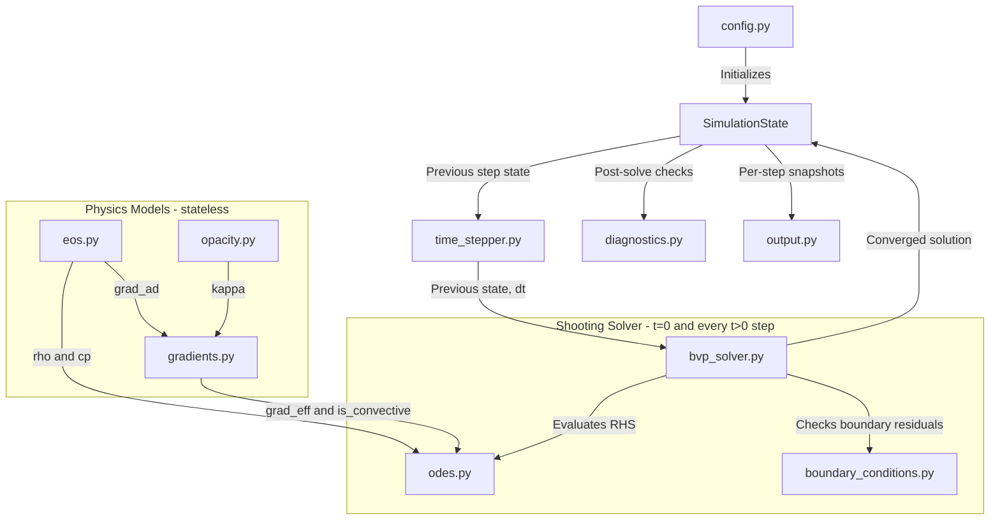

# PlanetFormationSim — Architecture & Development Plan

**Project:** 1D Quasi-Static Planetary Gas Envelope Collapse (Kelvin-Helmholtz Contraction)
**Course:** Computational Physics
**Last Updated:** 2026-07-27

---

## Table of Contents

1. [Physics Overview](#1-physics-overview)
2. [Module Structure](#2-module-structure)
3. [Architecture Data-Flow Diagram](#3-architecture-data-flow-diagram)
4. [Key Design Decisions](#4-key-design-decisions)
5. [Sequential Sub-Tasks Breakdown](#5-sequential-sub-tasks-breakdown)

---

## 1. Physics Overview

### Goal
Simulate the slow, quasi-static Kelvin-Helmholtz contraction of a self-gravitating gas
envelope on a Lagrangian mass grid — from just after it has already formed a
gravitationally bound object, down to the point where central conditions approach H2
dissociation. No hydrodynamics, no radiative transfer beyond a diffusion-limit opacity
closure — only time-evolution of structural (stellar-interior-type) equations.

### Formation Scenario and Scope

The envelope is assumed to have formed via gravitational instability (GI) / disk
fragmentation in the outer regions (~50 AU) of a protoplanetary disk. That physical picture
splits into two phases with very different character, and this project only models one of
them:

1. **Initial collapse (out of scope).** A locally dense, gravitationally unstable region
   of the disk undergoes fast, inertia-dominated, hydrodynamic free-fall collapse into a
   bound clump. A quasi-static/hydrostatic-equilibrium solver is structurally incapable of
   representing this — force balance is assumed at every instant, which is the opposite of
   free-fall. This is the same reason `T_DISSOCIATION_LIMIT` (§4.6) halts the code at the
   *far* end of validity, once H2 dissociation triggers a second dynamical collapse.
   Standard practice in the literature (pre-main-sequence Henyey-track modeling;
   Bodenheimer & Pollack 1986; Marley et al. 2007 "hot start" gas-giant models) is to never
   simulate this phase directly — hand off from an assumed or externally-computed
   post-collapse state instead.
2. **Kelvin-Helmholtz contraction (this project's actual scope).** The already-collapsed,
   compact, high-entropy object slowly radiates away its formation heat and contracts over
   a ~Myr timescale, remaining close to hydrostatic equilibrium throughout. This is what
   the 4-ODE system below models.

Consequently, `t=0` in this simulation is **not** a diffuse pre-collapse cloud — it is a
compact, hot, high-entropy "just-collapsed" protoplanet (Sub-task 5). An earlier version of
this project instead started from a diffuse, disk-pressure-confined cloud and tried to
evolve it forward quasi-statically; that premise turned out to be a genuine mathematical
dead end (proven, not a numerical artifact — a diffuse cloud already in stable equilibrium
with fixed ambient conditions has no reason to evolve) and was abandoned. See PROGRESS.md
for the full investigation behind this change.

### Grid
- **Coordinate:** Lagrangian mass coordinate $m$ (mass enclosed within radius $r$)
- **Domain:** $m = 0$ (center) to $m = M_\text{total}$ (surface)

### System of 4 ODEs

| # | Equation | Physical meaning |
|---|---|---|
| 1 | $\dfrac{dr}{dm} = \dfrac{1}{4\pi r^2 \rho}$ | Continuity / mass-radius relation |
| 2 | $\dfrac{dP}{dm} = -\dfrac{Gm}{4\pi r^4}$ | Hydrostatic equilibrium |
| 3 | $\dfrac{dL}{dm} = -c_p \dfrac{\partial T}{\partial t} + \dfrac{1}{\rho}\dfrac{\partial P}{\partial t}$ | Energy equation (KH contraction source) |
| 4 | $\dfrac{dT}{dm} = \dfrac{T}{P} \nabla_\text{eff} \dfrac{dP}{dm}$ | Temperature structure (Schwarzschild criterion) |

### Constitutive Relations
- **EOS:** Combined ideal gas + non-relativistic electron degeneracy (Sub-task 2f, done) —
  $P = P_\text{ideal}(\rho,T) + P_\text{degenerate}(\rho)$, $P_\text{ideal}=\dfrac{\rho k_B
  T}{\mu m_H}$, $P_\text{degenerate}=\dfrac{h^2}{20m_e}\left(\dfrac{3}{\pi}\right)^{2/3}
  \left(\dfrac{\rho}{\mu_e m_H}\right)^{5/3}$. Ideal-gas-only thermal pressure cannot support
  a Jupiter-mass object in compact hydrostatic equilibrium at any physically reasonable
  (sub-dissociation) temperature; real gas giants and brown dwarfs are partially
  electron-degenerate essentially from formation onward (Zapolsky & Salpeter 1969), not
  just late in a cooling history. `eos.density(P,T,mu,mu_e)` inverts this (no closed form)
  via vectorized Newton-Raphson.
- **Opacity:** Bell & Lin (1994) piecewise power-law — $\kappa = \kappa_i \rho^a T^b$ across 8 regimes (see §4.3)
- **Temperature gradient:** Schwarzschild criterion — $\nabla_\text{eff} = \nabla_\text{rad}$ (radiative) if $\nabla_\text{rad} < \nabla_\text{ad}$; otherwise $\nabla_\text{eff} = \nabla_\text{ad}$ (convective)
  - `grad_rad = (3 * kappa * L * P) / (16 * pi * a_rad * c * G * m * T^4)`
  - $\nabla_\text{ad} = \dfrac{\gamma - 1}{\gamma}$ for ideal gas

### Boundary Conditions

| Location | Condition |
|---|---|
| Center ($m = 0$) | $r = 0$, $L = 0$ |
| Surface ($m = M_\text{total}$) | $P = P_\text{nebula}$ (mechanical); $L = 4\pi R^2\sigma_\text{SB}(T^4 - T_\text{nebula}^4)$ (thermal — net radiative flux balance, §4.7; **not** a rigid $T=T_\text{nebula}$ clamp) |

### Numerical Approach
- **Inner spatial solver:** a **shooting method** (`scipy.integrate.solve_ivp` outward
  integration + root-finding on the central conditions), used for both the $t=0$ structure
  and every $t>0$ timestep. `scipy.integrate.solve_bvp` was the original design and was
  abandoned for both cases — see §4.2 and PROGRESS.md for why.
- **Outer time loop:** advances time by $\Delta t$ via a genuinely implicit (Henyey-style)
  scheme — $\partial T/\partial t$, $\partial P/\partial t$ in ODE 3 are computed directly
  from the difference between the current trial state and the previous converged state,
  divided by $dt$. Not frozen, and not supplemented by any additional assumed forcing term
  (§4.8 records why an earlier attempt to add one was reverted).

---

## 2. Module Structure

```
PlanetFormationSim/
├── main.py                   # Orchestrator: parse config, run time loop, save output
├── config.py                 # Physical constants, nebula params, grid settings, flags
├── state.py                  # SimulationState dataclass: all field arrays + time
├── eos.py                    # Constitutive relations (ideal gas + planned degeneracy term)
├── opacity.py                # Bell & Lin (1994) 8-regime piecewise opacity
├── gradients.py               # ∇_rad, ∇_ad, Schwarzschild criterion → ∇_eff
├── odes.py                    # RHS of the 4-ODE system
├── boundary_conditions.py    # Center + surface residuals (net-flux radiative surface BC)
├── bvp_solver.py              # Shooting-method solver: t=0 structure and every t>0 step
├── time_stepper.py           # Outer loop: run(); compute_time_derivatives (diagnostic only)
├── diagnostics.py            # Virial theorem, energy conservation, regime logging
└── output.py                 # NPZ snapshots, matplotlib plotting helpers
```

### Module Responsibilities (one-line each)

| Module | Responsibility |
|---|---|
| `config.py` | Single source of truth for all numerical values and simulation flags; no computation |
| `state.py` | `SimulationState` dataclass holding the current and previous grid + field arrays |
| `eos.py` | Vectorized constitutive relations (ideal gas; non-relativistic electron-degeneracy pressure planned, Sub-task 2f); no side effects |
| `opacity.py` | Bell & Lin piecewise opacity with density-dependent regime boundaries |
| `gradients.py` | Schwarzschild switch; returns $\nabla_\text{eff}$ and a boolean `is_convective` mask; also a marginal-convection diagnostic luminosity helper |
| `odes.py` | Pure function: takes $(m, \mathbf{y}, \dot{T}, \dot{P})$ and returns $d\mathbf{y}/dm$ |
| `boundary_conditions.py` | Pure function: 4 residuals — center ($r=0$, $L=0$) and surface ($P=P_\text{neb}$, net-flux radiative) |
| `bvp_solver.py` | Shooting-method solver for both the $t=0$ compact hot-start structure and every $t>0$ implicit timestep; `solve_bvp` is not used anywhere |
| `time_stepper.py` | Outer time loop (`run`); `compute_time_derivatives` retained as a post-hoc finite-difference diagnostic only — not on the critical solve path |
| `diagnostics.py` | Post-solve checks; virial theorem; opacity regime distribution per timestep |
| `output.py` | Snapshot I/O and matplotlib helpers; no physics |

---

## 3. Architecture Data-Flow Diagram



---

## 4. Key Design Decisions

### 4.1 `SimulationState` as the Central Data Object

A `@dataclass` holding `m` (mass grid), `r`, `P`, `T`, `L`, `rho` (numpy arrays), current time `t`, and a reference to the previous state. All modules receive state and return new state — none hold mutable state themselves. This enforces functional purity and simplifies testing.

### 4.2 Shooting-Method Formulation (supersedes an earlier `solve_bvp` design)

`scipy.integrate.solve_bvp` was the original design (state vector $\mathbf{y}=[r,P,L,T]$,
independent variable $m$) but proved structurally unreliable for this problem at both
$t=0$ and $t>0$: a source-term-driven energy equation gives a rank-deficient Jacobian, and
the near-surface pressure-scale-height boundary layer (P dropping many decades over a small
mass range) breaks its collocation mesh regardless of the scaling strategy tried. Every
solve in this codebase instead uses a **shooting method**: integrate outward from the
center with `scipy.integrate.solve_ivp` (adaptive, no global Jacobian) from trial central
conditions, and root-find on those trial values until the surface conditions are met.

- **$t=0$:** shoot on $P_\text{center}$ alone ($T_\text{center}$ fixed at
  `config.T_CENTER_INITIAL`, a prescribed "hot start" parameter — not a shooting unknown)
  to match $P(M_\text{total})=P_\text{neb}$.
- **$t>0$:** shoot on $(\ln P_\text{center}, \ln T_\text{center})$ (log-parametrized for
  guaranteed positivity) to match both $P(M_\text{total})=P_\text{neb}$ and the net-flux
  radiative surface condition (§4.7), via `scipy.optimize.fsolve`.

### 4.3 Bell & Lin (1994) Opacity — Density-Dependent Regime Boundaries

The transition between regime $n$ and $n+1$ is defined by $\kappa_n = \kappa_{n+1}$, giving a transition temperature that depends on $\rho$:

$$T_{n \to n+1}(\rho) = \left[\frac{\kappa_i^{(n+1)}}{\kappa_i^{(n)}} \cdot \rho^{(a_{n+1} - a_n)}\right]^{1/(b_n - b_{n+1})}$$

The 8 regimes (CGS units, $\kappa$ in cm² g⁻¹):

| # | Physical process | $\kappa_i$ | $a$ | $b$ |
|---|---|---|---|---|
| 1 | Ice grains | $2 \times 10^{-4}$ | 0 | 2 |
| 2 | Ice grain evaporation | $2 \times 10^{16}$ | 0 | −7 |
| 3 | Metal grains | $0.1$ | 0 | 1/2 |
| 4 | Metal grain evaporation | $2 \times 10^{81}$ | 1 | −24 |
| 5 | Molecules | $10^{-8}$ | 2/3 | 3 |
| 6 | H⁻ scattering | $10^{-36}$ | 1/3 | 10 |
| 7 | Bound-free/free-free (Kramers) | $1.5 \times 10^{20}$ | 1 | −5/2 |
| 8 | Electron scattering | $0.348$ | 0 | 0 |

**Internal structure of `opacity.py`:**
- **Layer 1 — Data:** Immutable `RegimeParams` namedtuples (one per row above)
- **Layer 2 — Transitions:** `transition_temperature(rho, n)` → $T_{n \to n+1}(\rho)$; `determine_regime(rho, T)` → integer index, fully vectorized
- **Layer 3 — Public API:** `bell_lin_opacity(rho, T)` → $\kappa$, vectorized

**Smooth-transition flag:** $\kappa(T)$ is continuous at transitions by construction, but $d\kappa/dT$ has a kink, which can perturb the collocation Jacobian. `config.py` exposes `OPACITY_SMOOTH_TRANSITIONS: bool = False`. When `True`, a logistic blend of width $\delta\!\log T \approx 0.05$ dex softens the kink. Default is `False` (physically correct hard switch).

### 4.4 `gradients.py` Interface Contract

Returns a tuple `(grad_eff, is_convective)` where `is_convective` is a boolean numpy array. This mask is passed to `diagnostics.py` for per-timestep regime reporting, and can be used by `output.py` to shade convective zones on temperature-profile plots. `gradients.py` also provides `marginal_convective_luminosity(m, P, T, kappa, grad_ad)`, a diagnostic-only helper used by `bvp_solver.py`'s $t=0$ construction (§5, Sub-task 5) to populate a physically meaningful $L(m)$ for a structure whose $T(m)$ was built directly from the adiabat rather than solved for.

### 4.5 Adaptive Time-Stepping

$\Delta t \leq \alpha \cdot \min_i\!\left(T_i / |\dot{T}_i|\right)$ — a local thermal timescale limiter. The safety factor $\alpha$ is set in `config.py`. The fixed-dt path is retained for reproducibility and comparison. (Sub-task 9, not started — blocked behind Sub-tasks 5–8.)

### 4.6 Hydrogen Dissociation Halt — Validity Limit of the Quasi-Static Assumption

The quasi-static approximation (hydrostatic equilibrium at every timestep) is valid only while the envelope can radiate away its gravitational energy slowly enough to remain in pressure balance. This assumption breaks down irreversibly when the core temperature approaches **~2000 K**, at which point molecular hydrogen ($H_2$) begins to dissociate into atomic hydrogen ($2H$).

**Physical mechanism:**
- $H_2$ dissociation is highly endothermic ($\sim 4.5\,\text{eV}$ per molecule). The energy that would otherwise raise the temperature instead goes into breaking molecular bonds.
- This causes the effective adiabatic index $\gamma_\text{eff}$ to drop well below $4/3$ over the dissociation zone.
- For an ideal gas, hydrostatic stability requires $\gamma > 4/3$. When $\gamma_\text{eff} < 4/3$, the envelope becomes dynamically unstable: a small compression lowers the pressure support faster than gravity, and the envelope enters **free-fall (dynamic) collapse** on a timescale of seconds to hours — many orders of magnitude faster than the Kelvin-Helmholtz timescale modelled here.
- Since this code has no hydrodynamic solver, it cannot follow the dynamic collapse phase.

**Consequence for the simulation:**
When the central temperature $T(m=0)$ reaches `T_DISSOCIATION_LIMIT = 2000.0 K`, the outer time loop in `time_stepper.py` must perform a **graceful halt**: log an informative message (timestep number, current time, $T_\text{center}$), save a final snapshot, and exit cleanly. Continuing beyond this point would produce unphysical quasi-static solutions.

This threshold is stored as `T_DISSOCIATION_LIMIT` in `config.py` and checked after every solve in the outer time loop (Sub-task 8).

### 4.7 Net-Flux Radiative Surface Condition (replaces a rigid $T=T_\text{neb}$ clamp)

The surface thermal boundary condition is
$$L(M_\text{total}) = 4\pi R^2\sigma_\text{SB}\left(T^4-T_\text{neb}^4\right)$$
— the photosphere emits at its own $T$ and absorbs from the ambient field at $T_\text{neb}$;
net emission is the difference. This reduces to exactly $T=T_\text{neb}$, $L=0$ at
equilibrium, but — unlike a rigid clamp — does not force $T$ back to $T_\text{neb}$ once
something has displaced the envelope from it.

**Why this matters (confirmed, both analytically and numerically):** a rigid
$T=T_\text{neb}$ clamp makes "no change at all" an *exact* algebraic solution of the
governing equations for any $dt$, whenever the previous state already satisfies the
(fixed) outer boundary conditions — which every converged state does by construction. If
nothing changes, $\partial T/\partial t=\partial P/\partial t=0 \Rightarrow dL/dm\equiv0
\Rightarrow L\equiv0$ (center BC) $\Rightarrow \nabla_\text{rad}\equiv0 \Rightarrow
dT/dm\equiv0$, self-consistent with $T$ staying put. Confirmed numerically across $dt$
spanning six orders of magnitude and six wildly different shooting starting guesses, all
converging to the same machine-precision-identical answer. This holds regardless of
explicit vs. implicit time-differencing — it is a structural property of re-solving a
static boundary-value problem each step against a rigidly fixed external condition, not a
scheme artifact. The net-flux condition above removes this specific degeneracy (though see
§5's Sub-task 5 entry — removing it was necessary but not sufficient for sustained
evolution; the deeper fix is the compact hot-start premise in §1).

### 4.8 Energy Equation: No Added Forcing Term (a rejected alternative, recorded to prevent repeating it)

The energy equation is used in its textbook implicit form only:
$$\frac{dL}{dm} = -c_P\frac{T_\text{new}-T_\text{prev}}{dt} + \frac{1}{\rho}\frac{P_\text{new}-P_\text{prev}}{dt}$$
An earlier attempt added an extra, externally-assumed homologous-contraction rate
($T_\text{prev}/t_\text{KH}$, $4P_\text{prev}/t_\text{KH}$) on top of this, intended to keep
evolution going past a single step. **That double-counts compressional heating**: the
implicit difference already *is* the complete statement of how a mass shell's thermal state
changed over $dt$, from whatever physically happened (including contraction) — there is no
second, independent channel for gravitational contraction to enter the energy budget.
Proof it was wrong: it produced a state that was *exactly* frozen step-to-step yet
continued to radiate a constant, non-decaying $L$ — a direct violation of energy
conservation (there is no reservoir to radiate from if nothing is changing). Real evolution
past the first step instead comes from `t=0` already being a genuine thermal
disequilibrium (§1, §5's Sub-task 5), not an injected rate law inside this equation.

---

## 5. Sequential Sub-Tasks Breakdown

### Phase 1 — Static Skeleton & Physical Validation

---

#### Sub-task 1 — `config.py` + `state.py`

**Goal:** Establish the single source of truth for all constants and the central data container.

**Deliverables:**
- All CGS physical constants: $G$, $c$, $a_\text{rad}$, $k_B$, $m_H$, $\sigma_\text{SB}$
- Simulation parameters: $M_\text{total}$, $P_\text{neb}$, $T_\text{neb}$, $\mu$, $\gamma$, `n_grid_points`, `OPACITY_SMOOTH_TRANSITIONS`
- `T_DISSOCIATION_LIMIT = 2000.0` — core temperature ceiling above which $H_2$ dissociation invalidates the quasi-static assumption (see §4.6)
- `SimulationState` dataclass with typed numpy array fields and a `prev` reference slot

**Exit criterion:** Print all constants; confirm CGS unit self-consistency by hand for 3 key relations (e.g., $P = \rho k_B T / \mu m_H$ gives Pa when inputs are CGS).

**Status: Done.**

---

#### Sub-task 2 — `eos.py` + `opacity.py`

This sub-task is split into sequential steps due to the complexity of the Bell & Lin opacity model.

**Sub-task 2a — `eos.py` and raw power-law evaluator**

- Implement `density(P, T, mu)`, `specific_heat_cp(gamma, mu)`, `grad_adiabatic(gamma)` — all vectorized
- Define the `RegimeParams` namedtuple and the immutable `REGIMES` table (all 8 rows)
- Implement `evaluate_regime(kappa_i, a, b, rho, T)` — a single vectorized power-law call

*Exit criterion:* Each of the 8 rows evaluates correctly at a hand-verified (ρ, T) reference point. **Status: Done** (revised by Sub-task 2f below).

**Sub-task 2b — Transition temperature function**

- Implement `transition_temperature(rho, n)` using the analytic formula in §4.3
- Handle the degenerate case $b_n = b_{n+1}$ (log a warning; this would indicate a data error)
- Plot $T_{n \to n+1}(\rho)$ over $\rho \in [10^{-15},\, 10^{-5}]$ g cm⁻³ for all 7 transitions

*Exit criterion:* Transition curve slopes in log-log space match the analytic exponent $[(a_{n+1}-a_n)/(b_n - b_{n+1})]$ for each pair. **Status: Done.**

**Sub-task 2c — `determine_regime` and `bell_lin_opacity`**

- Implement `determine_regime(rho, T)` vectorized; compute all 7 transition temperatures per point and find the bin (e.g., via `np.searchsorted` on the sorted transition array)
- Implement `bell_lin_opacity(rho, T)` as the sole public API function; dispatches to the correct regime using array indexing / `np.where`

*Exit criterion:* Function accepts and returns numpy arrays of arbitrary shape with no Python-level loops; no NaN or Inf over the physically relevant domain. **Status: Done.**

**Sub-task 2d — Validation suite (4 specific checks)**

| Check | Method | Pass Condition |
|---|---|---|
| **Regime continuity** | At each of the 7 transitions, evaluate $\kappa$ from both adjacent regimes at $(ρ,\; T_{n \to n+1})$ | Relative difference $< 10^{-10}$ |
| **Regime ordering in T** | At fixed $\rho = 10^{-10}$ g cm⁻³, sweep T from 100 K to 50 000 K; log regime index | Index is monotonically non-decreasing |
| **Reference point check** | Evaluate $\kappa$ at 3–4 (ρ, T) pairs traceable to Bell & Lin (1994) | Agree within the paper's own rounding |
| **Vectorization stress test** | Pass a 2D mesh covering all 8 regimes simultaneously | Output shape matches input; no NaN/Inf |

**Status: Done.**

**Sub-task 2e — `opacity.py` ↔ `gradients.py` interface preview**

- Call `bell_lin_opacity` along a representative 1D profile (varying T with depth, ρ from a polytropic estimate)
- Plot $\kappa(m)$ and visually confirm that regime transitions occur at physically plausible depths

*Exit criterion:* Profile plot shows expected qualitative behavior. **Status: Done.**

---

#### Sub-task 2f — `eos.py`: Non-Ideal EOS — Electron Degeneracy Pressure — **DONE (2026-07-27)**

**Status: implemented and validated — the hypothesis was confirmed.** Sub-task 5's compact hot-start
construction (below) hit two numerical dead ends this session: a pure ideal-gas adiabat at
a physically reasonable central temperature settles at $R\approx300\,R_\text{Jup}$, not a
genuinely compact few-$R_\text{Jup}$ structure, and a fully self-consistent version of the
same construction (using the real 4-ODE system rather than a shortcut) settles at an *even
more* extended $R\approx27{,}000\,R_\text{Jup}$. **Strong physical inference, not yet
directly confirmed in this codebase:** both are symptoms of the same missing physics —
ideal-gas thermal pressure alone cannot support a Jupiter-mass object in compact
hydrostatic equilibrium at any temperature below H2 dissociation. Real gas giants and brown
dwarfs are partially electron-degenerate essentially from formation onward — not just late
in a cooling history, the common but incorrect intuition (at Jupiter's characteristic
density, the electron Fermi temperature is order $10^5$–$10^6$ K, far above any plausible
formation temperature, so degeneracy is significant from the start; classic reference:
Zapolsky & Salpeter 1969). This is why published gas-giant thermal-evolution codes
(Bodenheimer & Pollack 1986; Pollack et al. 1996; Marley et al. 2007; and essentially the
whole subsequent literature) universally use a non-ideal EOS (typically built on Saumon,
Chabrier & van Horn 1995) rather than pure ideal gas, even for their earliest, hottest
models.

**Goal:** add the minimal physics needed to test this hypothesis, before touching
`bvp_solver.py` again.

**Deliverables:**
- A non-relativistic electron-degeneracy pressure term, the classical free-electron-gas
  result (Chandrasekhar 1939; Kippenhahn & Weigert Ch. 15):
  $$P_\text{degenerate} = \frac{h^2}{20\, m_e}\left(\frac{3}{\pi}\right)^{2/3}
  \left(\frac{\rho}{\mu_e m_H}\right)^{5/3}$$
  combined additively with the existing ideal-gas pressure: $P = P_\text{ideal} +
  P_\text{degenerate}$ (a standard first-order approximation for this purpose, not a full
  equation-of-state table). Requires three new constants in `config.py`, none currently
  present: Planck's constant $h$ and electron mass $m_e$ (only $G$, $c$, $a_\text{rad}$,
  $k_B$, $m_H$, $\sigma_\text{SB}$ exist today), and a mean-molecular-weight-per-electron
  $\mu_e$, distinct from `config.MU` (mean weight per particle).
- Re-derive the Sub-task 5 compact-structure estimate analytically/semi-analytically with
  this term included (extending the Lane-Emden-type approach already used for the
  ideal-gas-only case, or an equivalent numerical check) **before** resuming any
  shooting-method work, to confirm the hypothesis actually predicts a few-$R_\text{Jup}$
  radius at a reasonable $T_\text{center}$.

**Exit criterion:** an analytic or semi-analytic check that including
$P_\text{degenerate}$ moves the self-consistent radius at `config.T_CENTER_INITIAL` from
$\sim300\,R_\text{Jup}$ down to a genuinely compact (few $R_\text{Jup}$) value.

**Met, exactly as predicted.** The pure T=0 degenerate (Zapolsky-Salpeter-style) analytic
estimate gave $R\approx3.11\,R_\text{Jup}$; the actual shooting code, once the combined EOS
was wired in (`eos.degenerate_pressure`, `eos.density` revised to a vectorized
Newton-Raphson inversion of the additive combined pressure), converged to
$R\approx3.17\,R_\text{Jup}$ — close agreement. 4 new `validation.py` checks added and
passing (reference-point, asymptotic-limit, round-trip-inversion, and a visible $P(\rho)$
plot). **However, resuming Sub-task 5's structural solver work exposed a second, more
fundamental blocker, not resolved by this sub-task**: the inherited
$P(M_\text{total})=P_\text{neb}$ outer boundary condition has no solution at all for the
degenerate-supported structure (a genuine gap in achievable surface pressure, not a
numerical-precision issue — PROGRESS.md has the full numerical trail). Sub-task 5 is now
blocked on redesigning that boundary condition, not on this sub-task's EOS work, which
stands as complete.

---

#### Sub-task 3 — `gradients.py`

**Goal:** Implement and validate the Schwarzschild criterion over the full temperature range.

**Deliverables:**
- `grad_radiative(L, m, P, T, kappa)` using `grad_rad = (3 * kappa * L * P) / (16 * pi * a_rad * c * G * m * T^4)`
- `effective_gradient(grad_rad, grad_ad)` → `(grad_eff, is_convective)`
- Assert $\kappa > 0$ at entry (guards against upstream errors in `opacity.py`)

**Exit criterion:**
- Verify $\nabla_\text{rad} > \nabla_\text{ad}$ triggers convection at high $L$ or high $\kappa$
- Run validation over $T \in [100\,\text{K},\; 50\,000\,\text{K}]$ to exercise all opacity regimes
- Confirm `is_convective` mask is correct for both limiting cases

**Status: Done.** (Also gained `marginal_convective_luminosity`, §4.4, for Sub-task 5's use.)

---

#### Sub-task 4 — `odes.py` + `boundary_conditions.py`

**Goal:** Formulate the 4-ODE RHS and boundary residuals.

**Deliverables:**
- `stellar_odes(m, y, dT_dt, dP_dt)` → `[dr/dm, dP/dm, dL/dm, dT/dm]`
  - `y = [r, P, L, T]`; `rho` derived internally from EOS
  - `dT_dt`, `dP_dt` are pre-computed arrays (implicit differencing, $t>0$; unused at $t=0$)
- `boundary_conditions(ya, yb)` → 4 residuals, with `r_b, P_b, L_b, T_b = yb`:
  `[ya[0], ya[2], P_b - P_neb, L_b - L_expected(T_b, r_b)]` (§4.7)

**Exit criterion:**
- Feed in a known analytic profile (constant-density sphere); verify each ODE term's numerical magnitude is dimensionally consistent
- Confirm 4 ODEs + 4 BCs → well-posed system

**Status: Done.** (`boundary_conditions.py`'s surface thermal residual was revised in place, §4.7 — the mechanical residual and center residuals are unchanged.)

---

#### Sub-task 5 — `bvp_solver.py` ($t=0$ structure) — REVISED TWICE, **⏸ PAUSED mid-implementation (2026-07-27)**

This sub-task has gone through two major premise changes; PROGRESS.md has the full
investigation behind each.

**Premise 1 (original, superseded): diffuse pre-collapse clump.** The first
implementation built $t=0$ as a diffuse, disk-pressure-confined cloud in isothermal
equilibrium at $T_\text{neb}$ ($L\equiv0$) — a hard mathematical consequence of
$\partial T/\partial t=\partial P/\partial t=0$ at a genuine $t=0$ (no previous state to
difference against), and also a real, Bonnor-Ebert-subcritical equilibrium
($M_\text{TOTAL}/M_\text{BE}\approx0.089$) given the corrected Hayashi (1981) MMSN nebula
conditions at ~50 AU. This converged cleanly ($R\approx13$ AU) but turned out to be a
genuine, unbreakable fixed point under time-stepping (§4.7) — not fixable by any
per-timestep scheme, because the *premise itself* (a diffuse, pre-collapse object evolved
quasi-statically) was physically wrong (§1).

**Premise 2 (current): compact, hot, post-collapse protoplanet.** $t=0$ is instead a fully
convective object with a *prescribed* central temperature (`config.T_CENTER_INITIAL`),
representing a "just-collapsed" first core — standard practice in the literature (§1,
§4.7). This is implemented (`solve_static_structure`, shoots on $P_\text{center}$ alone via
a Lane-Emden-informed bracket + `brentq`) and runs without crashing, but its result is
**not yet a validated deliverable**:

- Numerically clean, but not compact: at `T_CENTER_INITIAL`=1200 K, the converged
  pure-ideal-gas adiabat gives $R\approx300\,R_\text{Jup}$ — confirmed via an independent
  Lane-Emden analytic solution (cross-checked against tabulated $n=1.5$/$n=3.0$ results
  before trusting it for this project's $n=2.5$ case).
- Not self-consistent with the real 4-ODE system: this construction bypasses
  `odes.stellar_odes`'s Schwarzschild criterion (it forces $dT/dm=\nabla_\text{ad}\cdot
  (T/P)\cdot dP/dm$ directly, since no self-consistent $L$ is available for a purely
  assumed-convective construction). Feeding it to `solve_timestep` as `state_prev` produces
  a huge residual ($\sim10^8$) even evaluated at its own unperturbed center values, and
  that residual is essentially insensitive to $dt$ (confirmed: a 10x smaller $dt$ barely
  changed it) — this state is not close to a genuine solution of the equations
  `solve_timestep` uses.
- A genuinely self-consistent alternative (full 4-ODE, real Schwarzschild criterion, $L$
  sourced from an assumed homologous contraction rate) does have a solution matching
  $P(M_\text{total})=P_\text{neb}$ at the same $T_\text{center}$, but it is *more* extended
  ($R\approx27{,}000\,R_\text{Jup}$), not compact — confirmed numerically (a clean,
  monotonic root-find, not a bracketing artifact), but the underlying reason has not been
  directly diagnosed (leading guess, unverified: the assumed contraction rate under-sources
  $L$ near the surface relative to what a true adiabat would need, letting the profile
  drift onto a shallower, more isothermal-like gradient there).

**Sub-task 2f (electron degeneracy pressure) is done and confirmed the missing-EOS
hypothesis exactly**: the analytic prediction ($R\approx3.11\,R_\text{Jup}$) was reproduced
almost exactly by the actual shooting code ($R\approx3.17\,R_\text{Jup}$). **But this
exposed the second, independent gap found during the 2026-07-27 correctness review as a
hard blocker, not just a follow-up.** With the combined EOS in place, no $P_\text{center}$
reaches anywhere near $P_\text{neb}$ at all — $P_\text{end}$ jumps discontinuously from
trapped below $\sim0.05$-$0.08\,\text{dyn/cm}^2$ (integration fails) to
$\ge2.79\times10^6\,\text{dyn/cm}^2$ (integration succeeds), confirmed not a
numerical-precision artifact (PROGRESS.md has the full trail). This is the same underlying
issue the correctness review found in the self-consistent (~27,000 $R_\text{Jup}$)
construction — a genuine transition to a radiative, nearly-isothermal, extended envelope
once the bulk equation of state is pushed to bridge all the way down to the tiny ambient
$P_\text{neb}$ — now sharper because the degenerate-supported interior is far stiffer.
Electron degeneracy pressure is negligible at the low densities where this forms, so
Sub-task 2f could not have fixed it. The real fix is replacing the inherited
$P(M_\text{total})=P_\text{neb}$ outer boundary condition with a physically-motivated
photospheric one — flagged as a concern for the diffuse-cloud design early in the project
(PROJECT_CONTEXT.md) but not revisited under the compact hot-start premise until this
session.

**Photospheric ($\tau=2/3$) outer BC: DONE, validated.** `solve_static_structure()`
converges cleanly: $R\approx3.172\,R_\text{Jup}$, mass relative residual $\approx0.16\%$.
Both shooting routines now locate the surface via a `solve_ivp` *event* (photosphere
crossing), matching enclosed mass to $M_\text{total}$, rather than a residual at a fixed
mass endpoint — full derivation and implementation detail in PROGRESS.md's 2026-07-27
entries.

**Bridging to `solve_timestep`: implemented, PAUSED, not working yet.**
`solve_static_structure`'s output is not itself a genuine solution of `solve_timestep`'s
real 4-ODE equations (confirmed sharply: evaluating them at its own values diverges,
$T\to3.4$ million K in one step) — standard "initial model relaxation" territory, not a bug.
`bvp_solver.relax_initial_state(state_0)` implements this via homotopy on
$\nabla_\text{eff}$ (blending the pure adiabat at $\alpha=0$, matching `state_0`'s own
construction exactly, toward the real Schwarzschild-selected value at $\alpha=1$) — its
first pseudo-step converges cleanly, validating the approach, but later steps hit a cascade
of `scipy` stiff-solver numerical edge cases (floating-point cancellation, `eos.density`
Newton non-convergence, negative-domain probing, clamp-induced overflow). **Two principled
fixes proposed, neither implemented — evaluate next session before touching this code
again:** (1) log-transformed state variables ($\ln P$, $\ln T$) for structural positivity;
(2) graceful degradation inside `eos.density` (bounded penalty instead of a hard assertion
on an unconvergeable probe). Full blow-by-blow, exact failure traces, and the rejected
"scale dL/dm by alpha" trap (a real mathematical dead end, not just a bad idea — collapses
to the original isothermal degeneracy) are in PROGRESS.md's 2026-07-27 entry — read it
before resuming.

**Deliverables (remaining):** resolve the relaxation numerical issue (Path 1 or 2 above);
confirm `relax_initial_state`'s output is genuinely self-consistent with `solve_timestep`'s
equations; re-validate `solve_timestep` starting from that state.

**Exit criterion:** `relax_initial_state` completes all 11 pseudo-steps without numerical
failure; the resulting state, fed to `solve_timestep(state, dt)` for a real `dt`, shows a
small residual at a reasonable starting guess (not divergence).

---

#### Sub-task 6 — `diagnostics.py` — **BLOCKED, pending Sub-task 5's final structure**

The existing checks (pressure-confined virial form, single-opacity-regime prediction) were
written for Premise 1's isothermal, pressure-confined state and no longer apply once $t=0$
is a compact, self-gravitating, differentiated structure:

- **Virial theorem → standard (unconfined) form expected.** A self-gravitating object with
  negligible surface pressure (compact radius, $P_\text{neb}$ many orders of magnitude
  below $P_\text{center}$) should satisfy the textbook
  $E_\text{grav}+3(\gamma-1)E_\text{therm}\approx0$, not the pressure-confined form Premise
  1 needed.
- **Opacity regime distribution → multi-regime expected.** A hot center cooling to a
  cold surface should span several Bell & Lin regimes, not sit entirely in "Ice grains."
- **Mass reconstruction check** (continuity-equation self-consistency, `diagnostics.
  mass_reconstruction`) is regime-independent and should transfer directly once Sub-task 5
  has a final structure to check.

Revision deferred until Sub-task 5 produces a final, validated structure.

---

### Phase 2 — Dynamic Time Evolution

---

#### Sub-task 7 — `time_stepper.py` time derivatives — bootstrap mechanism now **OBSOLETE**

**The original homologous-contraction "bootstrap" — and every kick/forcing variant tried
this session — is no longer needed and should be removed.** It existed solely to break
Premise 1's isothermal fixed point (§4.7); once $t=0$ is genuinely hot and non-isothermal
(Premise 2), `solve_timestep` runs directly from `state_0` with no special first-step
handling. Two mechanisms were tried and rejected as *general* per-timestep drivers before
this was understood: a one-time "kick" construction (superseded along with Premise 1), and
an explicit forcing term added to the energy equation (§4.8 — rejected, double-counts
energy).

**What remains genuinely useful:** `compute_time_derivatives(state_curr, state_prev, dt)`'s
plain finite-difference branch (no bootstrap dispatch) is retained as a post-hoc diagnostic
utility — e.g. reporting the realized $\partial T/\partial t$, $\partial P/\partial t$ after
a step converges. It is not on the critical solve path (`bvp_solver._implicit_rhs_logm`
does its own inline differencing).

**Not yet implemented in code:** `time_stepper.py` still contains the original bootstrap
dispatch (`_bootstrap_time_derivatives`, the `state_prev=None` branch) as of this writing.
Removing it and updating the module docstring is pending, tracked together with Sub-task 8
below since both land in the same pass.

---

#### Sub-task 8 — Outer time loop `time_stepper.run()` — **BLOCKED, pending Sub-tasks 5–7**

**Deliverables (once unblocked):**
- `run(n_steps, dt)`: `state_0 = bvp_solver.solve_static_structure()` → repeated
  `bvp_solver.solve_timestep(state_prev, dt)` calls — no bootstrap/kick step of any kind.
- Energy equation stays in its pure implicit form (§4.8) — no added forcing term.
- Log convergence status at each step; warn (do not raise) on soft convergence failures.
- Store snapshots at configurable intervals.
- **Dissociation halt check** (unchanged from the original design): after each solve,
  compare `state.T[0]` against `config.T_DISSOCIATION_LIMIT`; if reached, save a final
  snapshot, log step/time/$T_\text{center}$, and exit cleanly.
- Remove `time_stepper.py`'s bootstrap dispatch (Sub-task 7).

**Exit criterion (revised):** a clear, sustained, monotonic trend ($r_\text{surface}$
decreasing, $L_\text{surface}$ staying nonzero and not decaying back toward zero,
$T_\text{center}$ increasing) over enough steps to be clearly above numerical noise — exact
step count/$dt$ to be determined empirically once Sub-task 5 is unblocked and validated.
Additionally verify the dissociation halt with an artificially-lowered
`T_DISSOCIATION_LIMIT`.

**Not yet started in code** — `time_stepper.py` is unchanged from Sub-task 7's original implementation as of this writing.

---

#### Sub-task 9 — Adaptive time-stepping

**Goal:** Ensure numerical stability over long runs.

**Deliverables:**
- Thermal timescale limiter: $\Delta t_\text{new} = \alpha \cdot \min_i(T_i / |\dot{T}_i|)$ with safety factor $\alpha$ from `config.py`
- Fixed-dt path retained via a `USE_ADAPTIVE_DT: bool` flag in `config.py`

**Exit criterion:** Compare fixed vs. adaptive $\Delta t$ runs; adaptive run conserves total energy measurably better over 100 steps.

**Status: Not started — blocked behind Sub-tasks 5–8.**

---

#### Sub-task 10 — `output.py` (snapshots and plots)

**Goal:** Reproducible data output and diagnostic visualizations.

**Deliverables:**
- Save each snapshot as `.npz` (mass grid + all fields + time + `is_convective` mask)
- Post-processing script: $r(t)$, $L_\text{surface}(t)$, $T_\text{center}(t)$ evolution curves
- 2-panel profile plots ($P(m)$ and $T(m)$) at selected snapshots; convective zones shaded using `is_convective` mask
- Opacity regime plot: $\kappa(m)$ colored by regime index

**Exit criterion:** All plots generated from saved `.npz` files without re-running the simulation.

**Status: Not started — blocked behind Sub-tasks 5–8.**

---

### Phase 3 — Extensions (Post-Course)

| # | Description | Key dependency |
|---|---|---|
| 11 | Replace Bell & Lin with OPAL tabulated opacity (bilinear interpolation) | `opacity.py` Layer 3 API unchanged |
| 12 | Solid core inner BC: $m = M_\text{core} > 0$, $r = R_\text{core}$ fixed | `boundary_conditions.py` |
| 13 | Accretion luminosity surface term | `boundary_conditions.py` + `time_stepper.py` |
| 14 | Full non-ideal EOS (tabulated, e.g. SCvH-style) if Sub-task 2f's minimal degeneracy term proves insufficient | `eos.py` |

---

## Implementation Order Summary

| # | File(s) | Depends on | Exit Criterion | Status |
|---|---|---|---|---|
| 1 | `config.py`, `state.py` | — | CGS unit consistency | Done |
| 2a | `eos.py`, regime table | 1 | 8 reference-point checks | Done |
| 2b | `transition_temperature` | 2a | Log-log slope matches analytic | Done |
| 2c | `determine_regime`, `bell_lin_opacity` | 2b | Vectorized, no NaN/Inf | Done |
| 2d | Validation suite | 2c | 4 checks pass | Done |
| 2e | Interface preview | 2d, 3 scaffold | $\kappa(m)$ profile sensible | Done |
| 2f | `eos.py` non-ideal EOS (electron degeneracy) | 2a | Analytic/semi-analytic check: compact radius at reasonable $T_\text{center}$ | Done (2026-07-27) |
| 3 | `gradients.py` | 2c | Schwarzschild switch correct over full T range | Done |
| 4 | `odes.py`, `boundary_conditions.py` | 1–3 | Dimensional consistency check | Done |
| **5a** | **`bvp_solver.py` outer BC redesign (photospheric, replaces $P=P_\text{neb}$)** | **2f, 4** | **Compact structure reaches a physically-motivated surface condition, not a $\sim10^7$ relative residual** | **Next milestone — design under review** |
| 5 | `bvp_solver.py` ($t=0$, compact hot start) | 4, 2f, **5a** | Compact, self-consistent $t=0$ structure | Blocked on 5a |
| 6 | `diagnostics.py` | 5 | Standard (unconfined) virial theorem; multi-regime opacity | Blocked on 5 |
| 7–8 | `time_stepper.py` | 5–6 | Envelope contracts over time, no bootstrap needed | Blocked on 5–6 |
| 9 | Adaptive $\Delta t$ | 7–8 | Better energy conservation | Blocked on 7–8 |
| 10 | `output.py` | all | Reproducible plots from `.npz` | Blocked on 7–8 |
