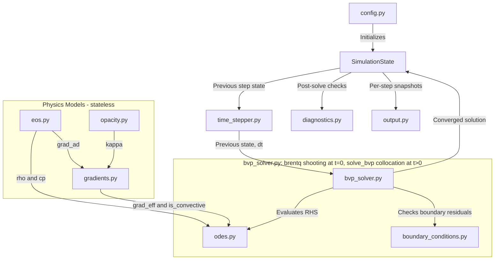

# PlanetFormationSim — Architecture & Development Plan

**Project:** 1D Quasi-Static Planetary Gas Envelope Collapse (Kelvin-Helmholtz Contraction)
**Course:** Computational Physics
**Last Updated:** 2026-07-27

---

## Table of Contents

1. [Physics Overview](#1-physics-overview)
2. [Module Structure](#2-module-structure)
3. [Architecture Data-Flow Diagram](#3-architecture-data-flow-diagram)
4. [Key Design Decisions](#4-key-design-decisions)
5. [Sequential Sub-Tasks Breakdown](#5-sequential-sub-tasks-breakdown)

---

## 1. Physics Overview

### Goal
Simulate the slow, quasi-static Kelvin-Helmholtz contraction of a self-gravitating gas
envelope on a Lagrangian mass grid — from just after it has already formed a
gravitationally bound object, down to the point where central conditions approach H2
dissociation. No hydrodynamics, no radiative transfer beyond a diffusion-limit opacity
closure — only time-evolution of structural (stellar-interior-type) equations.

### Formation Scenario and Scope

The envelope is assumed to have formed via gravitational instability (GI) / disk
fragmentation in the outer regions (~50 AU) of a protoplanetary disk. That physical picture
splits into three stages, separated by a dynamical collapse (the same two-step
first-core/second-collapse/second-core picture established for protostellar collapse,
Larson 1969, applied here to a GI-formed giant planet); this project models only the last
one. **Revised 2026-08-01** to resolve an earlier conflation of the first and third stages
— see PROGRESS.md for the full reasoning. (Named "Stage 1/2/3" here, not "Phase 1/2/3", to
avoid confusion with this document's own Phase 1/2/3 *project-milestone* structure below.)

1. **First hydrostatic core (out of scope; a future extension, see "Phase 3 —
   Extensions").** The initially diffuse, collapsing clump becomes optically thick and
   settles into a large ($10^2$-$10^3\,R_\text{Jup}$), quasi-static, ideal-gas-supported
   "first core." This stage ends once $T_\text{center}$ reaches ~2000 K and H2 dissociation
   (an endothermic sink that drops the effective adiabatic index below the stability
   threshold) triggers a second, dynamical collapse.
2. **Second (dynamical) collapse (out of scope).** Fast, inertia-dominated free-fall — a
   quasi-static/hydrostatic-equilibrium solver is structurally incapable of representing
   this (force balance is assumed at every instant, the opposite of free-fall).
3. **Post-second-collapse "hot start" (this project's actual scope).** The collapse halts
   once H2 dissociation completes and (partial) ionization plus electron degeneracy
   pressure re-stiffen the equation of state at much higher density, producing a compact
   ($\sim2$-$4\,R_\text{Jup}$) "second core." The literature-motivated central temperature
   for this state ($T_\text{center}\sim2\times10^4$-$5\times10^4$ K, anchored to present-day
   Jupiter's own modeled interior) does **not** reproduce that radius under this codebase's
   simplified (non-ionized) EOS — see PROGRESS.md's 2026-08-01 "Literature check" entry;
   `config.T_CENTER_INITIAL`'s exact value is still an open decision, not yet finalized.
   From here the object slowly radiates away its formation heat and
   contracts over a ~Myr Kelvin-Helmholtz timescale, remaining close to hydrostatic
   equilibrium throughout. This is what the 4-ODE system below models — `t=0` starts
   **already past** H2 dissociation, not approaching it from below. `T_DISSOCIATION_LIMIT`
   (§4.6) governed stage 1→2's transition, not this stage's forward evolution — removed
   from the active halt condition accordingly (Sub-task 8).

Standard practice in the literature (pre-main-sequence Henyey-track modeling; Bodenheimer &
Pollack 1986; Marley et al. 2007 "hot start" gas-giant models) is to never simulate stages 1
and 2 directly — hand off from an assumed or externally-computed post-collapse state
instead, which is exactly what this project does for stage 3.

Consequently, `t=0` in this simulation is **not** a diffuse pre-collapse cloud, and **not**
the first core either — it is the compact, very hot, high-entropy post-second-collapse
protoplanet (Sub-task 5). Two earlier premises were tried and superseded: a diffuse,
disk-pressure-confined cloud evolved forward quasi-statically (a genuine mathematical dead
end, proven not a numerical artifact — a diffuse cloud already in stable equilibrium with
fixed ambient conditions has no reason to evolve); and a compact hot start with
$T_\text{center}\sim1200\,$K, which conflated stage 1's temperature *ceiling* (2000 K,
where dissociation *triggers* the second collapse) with stage 3's starting *geometry* (a
compact radius only reached *after* that collapse) — corrected 2026-08-01. See PROGRESS.md
for both investigations.

### Grid
- **Coordinate:** Lagrangian mass coordinate $m$ (mass enclosed within radius $r$)
- **Domain:** $m = 0$ (center) to $m = M_\text{total}$ (surface)

### System of 4 ODEs

| # | Equation | Physical meaning |
|---|---|---|
| 1 | $\dfrac{dr}{dm} = \dfrac{1}{4\pi r^2 \rho}$ | Continuity / mass-radius relation |
| 2 | $\dfrac{dP}{dm} = -\dfrac{Gm}{4\pi r^4}$ | Hydrostatic equilibrium |
| 3 | $\dfrac{dL}{dm} = -c_p \dfrac{\partial T}{\partial t} + \dfrac{1}{\rho}\dfrac{\partial P}{\partial t}$ | Energy equation (KH contraction source) |
| 4 | $\dfrac{dT}{dm} = \dfrac{T}{P} \nabla_\text{eff} \dfrac{dP}{dm}$ | Temperature structure (Schwarzschild criterion) |

### Constitutive Relations
- **EOS:** Combined ideal gas + non-relativistic electron degeneracy (Sub-task 2f, done) —
  $P = P_\text{ideal}(\rho,T) + P_\text{degenerate}(\rho)$, $P_\text{ideal}=\dfrac{\rho k_B
  T}{\mu m_H}$, $P_\text{degenerate}=\dfrac{h^2}{20m_e}\left(\dfrac{3}{\pi}\right)^{2/3}
  \left(\dfrac{\rho}{\mu_e m_H}\right)^{5/3}$. Ideal-gas-only thermal pressure cannot support
  a Jupiter-mass object in compact hydrostatic equilibrium at any physically reasonable
  (sub-dissociation) temperature; real gas giants and brown dwarfs are partially
  electron-degenerate essentially from formation onward (Zapolsky & Salpeter 1969), not
  just late in a cooling history. `eos.density(P,T,mu,mu_e)` inverts this (no closed form)
  via vectorized Newton-Raphson.
- **Opacity:** Bell & Lin (1994) piecewise power-law — $\kappa = \kappa_i \rho^a T^b$ across 8 regimes (see §4.3)
- **Temperature gradient:** Schwarzschild criterion — $\nabla_\text{eff} = \nabla_\text{rad}$ (radiative) if $\nabla_\text{rad} < \nabla_\text{ad}$; otherwise $\nabla_\text{eff} = \nabla_\text{ad}$ (convective)
  - `grad_rad = (3 * kappa * L * P) / (16 * pi * a_rad * c * G * m * T^4)`
  - $\nabla_\text{ad} = \dfrac{\gamma - 1}{\gamma}$ for ideal gas

### Boundary Conditions

| Location | Condition |
|---|---|
| Center ($m = 0$) | $r = 0$, $L = 0$ |
| Surface ($m = M_\text{total}$) | $P = P_\text{nebula}$ (mechanical); $L = 4\pi R^2\sigma_\text{SB}(T^4 - T_\text{nebula}^4)$ (thermal — net radiative flux balance, §4.7; **not** a rigid $T=T_\text{nebula}$ clamp) |

### Numerical Approach
- **Inner spatial solver:** a **shooting method** (`scipy.integrate.solve_ivp` outward
  integration + root-finding on the central conditions), used for both the $t=0$ structure
  and every $t>0$ timestep. `scipy.integrate.solve_bvp` was the original design and was
  abandoned for both cases — see §4.2 and PROGRESS.md for why.
- **Outer time loop:** advances time by $\Delta t$ via a genuinely implicit (Henyey-style)
  scheme — $\partial T/\partial t$, $\partial P/\partial t$ in ODE 3 are computed directly
  from the difference between the current trial state and the previous converged state,
  divided by $dt$. Not frozen, and not supplemented by any additional assumed forcing term
  (§4.8 records why an earlier attempt to add one was reverted).

---

## 2. Module Structure

```
PlanetFormationSim/
├── main.py                   # Orchestrator: parse config, run time loop, save output
├── config.py                 # Physical constants, nebula params, grid settings, flags
├── state.py                  # SimulationState dataclass: all field arrays + time
├── eos.py                    # Constitutive relations (ideal gas + planned degeneracy term)
├── opacity.py                # Bell & Lin (1994) 8-regime piecewise opacity
├── gradients.py               # ∇_rad, ∇_ad, Schwarzschild criterion → ∇_eff
├── odes.py                    # RHS of the 4-ODE system
├── boundary_conditions.py    # Center + surface residuals (net-flux radiative surface BC)
├── bvp_solver.py              # t=0 structure (brentq shooting) + t>0 solve_bvp collocation solve (2026-08-07 pivot)
├── bvp_solver_shooting_archive.py  # RETIRED t>0 shooting code (relax_initial_state/solve_timestep) - archived, not imported
├── time_stepper.py           # Outer loop: run(); compute_time_derivatives (diagnostic only)
├── diagnostics.py            # Virial theorem, energy conservation, regime logging
└── output.py                 # NPZ snapshots, matplotlib plotting helpers
```

### Module Responsibilities (one-line each)

| Module | Responsibility |
|---|---|
| `config.py` | Single source of truth for all numerical values and simulation flags; no computation |
| `state.py` | `SimulationState` dataclass holding the current and previous grid + field arrays |
| `eos.py` | Vectorized constitutive relations (ideal gas; non-relativistic electron-degeneracy pressure planned, Sub-task 2f); no side effects |
| `opacity.py` | Bell & Lin piecewise opacity with density-dependent regime boundaries |
| `gradients.py` | Schwarzschild switch; returns $\nabla_\text{eff}$ and a boolean `is_convective` mask; also a marginal-convection diagnostic luminosity helper |
| `odes.py` | Pure function: takes $(m, \mathbf{y}, \dot{T}, \dot{P})$ and returns $d\mathbf{y}/dm$ |
| `boundary_conditions.py` | Pure function: 4 residuals — center ($r=0$, $L=0$) and surface ($P=P_\text{neb}$, net-flux radiative) |
| `bvp_solver.py` | $t=0$ compact hot-start structure via `brentq` shooting (unchanged since Sub-task 5); every $t>0$ implicit timestep via `scipy.integrate.solve_bvp` collocation (2026-08-07 pivot, `PLAN_BVP.md`) |
| `bvp_solver_shooting_archive.py` | Retired $t>0$ shooting implementation (`relax_initial_state`, `solve_timestep`), kept for historical reference only — not imported by any active module |
| `time_stepper.py` | Outer time loop (`run`); `compute_time_derivatives` retained as a post-hoc finite-difference diagnostic only — not on the critical solve path |
| `diagnostics.py` | Post-solve checks; virial theorem; opacity regime distribution per timestep |
| `output.py` | Snapshot I/O and matplotlib helpers; no physics |

---

## 3. Architecture Data-Flow Diagram



---

## 4. Key Design Decisions

### 4.1 `SimulationState` as the Central Data Object

A `@dataclass` holding `m` (mass grid), `r`, `P`, `T`, `L`, `rho` (numpy arrays), current time `t`, and a reference to the previous state. All modules receive state and return new state — none hold mutable state themselves. This enforces functional purity and simplifies testing.

### 4.2 Shooting-Method Formulation, then a Second Pivot Back to `solve_bvp` for $t>0$

**★ 2026-08-07 update — read this paragraph first.** The "shooting for everything" picture
below (originally written 2026-08-06) is now **historical for the $t>0$ problem only**.
After a second, more careful investigation (`PLAN_BVP.md`, kept as the full
milestone-by-milestone record — Milestones 0-6), shooting was retired for the $t>0$
relaxation/timestep solve and replaced by `scipy.integrate.solve_bvp` again, this time
successfully. The short version: five independent physics/BC hypotheses (ionization,
dissociation-$\mu$, opacity switches, center-BC self-consistency, log-space surface BC)
were each ruled out in isolation without moving a persistent near-photosphere crash;
analytic Jacobians (replacing scipy's FD estimate) reproduced the crash identically but
revealed *why* — the Jacobian is genuinely rank-deficient almost everywhere, because
100% convective saturation under the infinitely-efficient-convection idealization makes
$d(\nabla_\text{eff})/d(\nabla_\text{rad})=0$, decoupling $L$ from the $P$-$T$ relation.
The fix that shipped (state-vector nondimensionalization — $\hat r=r/R_\text{Jup}$,
$\hat L=\operatorname{arcsinh}(L/L_\text{scale})$ — plus corrected EOS thermodynamics
$\gamma\to5/3$, $\mu\to1.278$, a previously-hardcoded energy-equation $\delta$ coefficient,
plus a continuation endpoint `ALPHA_MAX`$=1-10^{-5}$ just short of literal $\alpha=1$)
attacks the conditioning directly rather than fixing the underlying rank deficiency — a
genuine mixing-length-theory convection treatment remains the mathematically complete fix
and stays on the roadmap, deliberately deferred. `bvp_solver.py`'s $t>0$ machinery
(`relax_initial_state`, `solve_timestep`) now uses this `solve_bvp`-based approach; the old
shooting implementation is archived in `bvp_solver_shooting_archive.py`, not deleted.
`PLAN_BVP.md` §3.6/§3.6.4 has the complete derivation, both real bugs the mandatory
FD-Jacobian cross-check caught, and the two-temperature (11500K, 12000K) confirmation.

**$t=0$ is unaffected by this second pivot** — `solve_static_structure()`'s shooting (a
simple 1D `brentq` root-find on $P_\text{center}$ alone, for a 3-ODE pure-adiabat
construction) was never implicated in the crash investigation and is unchanged; the
`solve_bvp` seed for the harder 4-ODE $t>0$ problem is literally built by calling this
function first. The original 2026-08-06 shooting-vs-`solve_bvp` history below is kept for
context — it explains why shooting was tried at all — but no longer describes $t>0$'s
actual solver.

---

`scipy.integrate.solve_bvp` was the original design (state vector $\mathbf{y}=[r,P,L,T]$,
independent variable $m$) but proved structurally unreliable for this problem at both
$t=0$ and $t>0$: a source-term-driven energy equation gives a rank-deficient Jacobian, and
the near-surface pressure-scale-height boundary layer (P dropping many decades over a small
mass range) breaks its collocation mesh regardless of the scaling strategy tried. Every
solve in this codebase then used a **shooting method**: integrate outward from the
center with `scipy.integrate.solve_ivp` (adaptive, no global Jacobian) from trial central
conditions, and root-find on those trial values until the surface conditions are met.

- **$t=0$ (still true today):** shoot on $P_\text{center}$ alone ($T_\text{center}$ fixed at
  `config.T_CENTER_INITIAL`, a prescribed "hot start" parameter — not a shooting unknown)
  to match the photospheric mass-matching condition (§4.7/§5 Sub-task 5 — superseded the
  $P(M_\text{total})=P_\text{neb}$ condition shown here originally).
- **$t>0$ (superseded 2026-08-07, see above):** shot on $(\ln P_\text{center}, \ln
  T_\text{center})$ via `scipy.optimize.fsolve`/`root(method="lm")` to match both the
  photospheric and net-flux radiative surface conditions (§4.7) — replaced by the
  `solve_bvp` collocation approach described above.

### 4.3 Bell & Lin (1994) Opacity — Density-Dependent Regime Boundaries

The transition between regime $n$ and $n+1$ is defined by $\kappa_n = \kappa_{n+1}$, giving a transition temperature that depends on $\rho$:

$$T_{n \to n+1}(\rho) = \left[\frac{\kappa_i^{(n+1)}}{\kappa_i^{(n)}} \cdot \rho^{(a_{n+1} - a_n)}\right]^{1/(b_n - b_{n+1})}$$

The 8 regimes (CGS units, $\kappa$ in cm² g⁻¹):

| # | Physical process | $\kappa_i$ | $a$ | $b$ |
|---|---|---|---|---|
| 1 | Ice grains | $2 \times 10^{-4}$ | 0 | 2 |
| 2 | Ice grain evaporation | $2 \times 10^{16}$ | 0 | −7 |
| 3 | Metal grains | $0.1$ | 0 | 1/2 |
| 4 | Metal grain evaporation | $2 \times 10^{81}$ | 1 | −24 |
| 5 | Molecules | $10^{-8}$ | 2/3 | 3 |
| 6 | H⁻ scattering | $10^{-36}$ | 1/3 | 10 |
| 7 | Bound-free/free-free (Kramers) | $1.5 \times 10^{20}$ | 1 | −5/2 |
| 8 | Electron scattering | $0.348$ | 0 | 0 |

**Internal structure of `opacity.py`:**
- **Layer 1 — Data:** Immutable `RegimeParams` namedtuples (one per row above)
- **Layer 2 — Transitions:** `transition_temperature(rho, n)` → $T_{n \to n+1}(\rho)$; `determine_regime(rho, T)` → integer index, fully vectorized
- **Layer 3 — Public API:** `bell_lin_opacity(rho, T)` → $\kappa$, vectorized

**Smooth-transition flag:** $\kappa(T)$ is continuous at transitions by construction, but $d\kappa/dT$ has a kink, which can perturb the collocation Jacobian. `config.py` exposes `OPACITY_SMOOTH_TRANSITIONS: bool = False`. When `True`, a logistic blend of width $\delta\!\log T \approx 0.05$ dex softens the kink. Default is `False` (physically correct hard switch).

### 4.4 `gradients.py` Interface Contract

Returns a tuple `(grad_eff, is_convective)` where `is_convective` is a boolean numpy array. This mask is passed to `diagnostics.py` for per-timestep regime reporting, and can be used by `output.py` to shade convective zones on temperature-profile plots. `gradients.py` also provides `marginal_convective_luminosity(m, P, T, kappa, grad_ad)`, a diagnostic-only helper used by `bvp_solver.py`'s $t=0$ construction (§5, Sub-task 5) to populate a physically meaningful $L(m)$ for a structure whose $T(m)$ was built directly from the adiabat rather than solved for.

### 4.5 Adaptive Time-Stepping

$\Delta t \leq \alpha \cdot \min_i\!\left(T_i / |\dot{T}_i|\right)$ — a local thermal timescale limiter. The safety factor $\alpha$ is set in `config.py`. The fixed-dt path is retained for reproducibility and comparison. (Sub-task 9, not started — blocked behind Sub-tasks 5–8.)

### 4.6 Hydrogen Dissociation Halt — Validity Limit of the Quasi-Static Assumption

The quasi-static approximation (hydrostatic equilibrium at every timestep) is valid only while the envelope can radiate away its gravitational energy slowly enough to remain in pressure balance. This assumption breaks down irreversibly when the core temperature approaches **~2000 K**, at which point molecular hydrogen ($H_2$) begins to dissociate into atomic hydrogen ($2H$).

**Physical mechanism:**
- $H_2$ dissociation is highly endothermic ($\sim 4.5\,\text{eV}$ per molecule). The energy that would otherwise raise the temperature instead goes into breaking molecular bonds.
- This causes the effective adiabatic index $\gamma_\text{eff}$ to drop well below $4/3$ over the dissociation zone.
- For an ideal gas, hydrostatic stability requires $\gamma > 4/3$. When $\gamma_\text{eff} < 4/3$, the envelope becomes dynamically unstable: a small compression lowers the pressure support faster than gravity, and the envelope enters **free-fall (dynamic) collapse** on a timescale of seconds to hours — many orders of magnitude faster than the Kelvin-Helmholtz timescale modelled here.
- Since this code has no hydrodynamic solver, it cannot follow the dynamic collapse phase.

**Consequence for the simulation:**
When the central temperature $T(m=0)$ reaches `T_DISSOCIATION_LIMIT = 2000.0 K`, the outer time loop in `time_stepper.py` must perform a **graceful halt**: log an informative message (timestep number, current time, $T_\text{center}$), save a final snapshot, and exit cleanly. Continuing beyond this point would produce unphysical quasi-static solutions.

This threshold is stored as `T_DISSOCIATION_LIMIT` in `config.py` and checked after every solve in the outer time loop (Sub-task 8).

### 4.7 Net-Flux Radiative Surface Condition (replaces a rigid $T=T_\text{neb}$ clamp)

The surface thermal boundary condition is
$$L(M_\text{total}) = 4\pi R^2\sigma_\text{SB}\left(T^4-T_\text{neb}^4\right)$$
— the photosphere emits at its own $T$ and absorbs from the ambient field at $T_\text{neb}$;
net emission is the difference. This reduces to exactly $T=T_\text{neb}$, $L=0$ at
equilibrium, but — unlike a rigid clamp — does not force $T$ back to $T_\text{neb}$ once
something has displaced the envelope from it.

**Why this matters (confirmed, both analytically and numerically):** a rigid
$T=T_\text{neb}$ clamp makes "no change at all" an *exact* algebraic solution of the
governing equations for any $dt$, whenever the previous state already satisfies the
(fixed) outer boundary conditions — which every converged state does by construction. If
nothing changes, $\partial T/\partial t=\partial P/\partial t=0 \Rightarrow dL/dm\equiv0
\Rightarrow L\equiv0$ (center BC) $\Rightarrow \nabla_\text{rad}\equiv0 \Rightarrow
dT/dm\equiv0$, self-consistent with $T$ staying put. Confirmed numerically across $dt$
spanning six orders of magnitude and six wildly different shooting starting guesses, all
converging to the same machine-precision-identical answer. This holds regardless of
explicit vs. implicit time-differencing — it is a structural property of re-solving a
static boundary-value problem each step against a rigidly fixed external condition, not a
scheme artifact. The net-flux condition above removes this specific degeneracy (though see
§5's Sub-task 5 entry — removing it was necessary but not sufficient for sustained
evolution; the deeper fix is the compact hot-start premise in §1).

### 4.8 Energy Equation: No Added Forcing Term (a rejected alternative, recorded to prevent repeating it)

The energy equation is used in its textbook implicit form only:
$$\frac{dL}{dm} = -c_P\frac{T_\text{new}-T_\text{prev}}{dt} + \frac{1}{\rho}\frac{P_\text{new}-P_\text{prev}}{dt}$$
An earlier attempt added an extra, externally-assumed homologous-contraction rate
($T_\text{prev}/t_\text{KH}$, $4P_\text{prev}/t_\text{KH}$) on top of this, intended to keep
evolution going past a single step. **That double-counts compressional heating**: the
implicit difference already *is* the complete statement of how a mass shell's thermal state
changed over $dt$, from whatever physically happened (including contraction) — there is no
second, independent channel for gravitational contraction to enter the energy budget.
Proof it was wrong: it produced a state that was *exactly* frozen step-to-step yet
continued to radiate a constant, non-decaying $L$ — a direct violation of energy
conservation (there is no reservoir to radiate from if nothing is changing). Real evolution
past the first step instead comes from `t=0` already being a genuine thermal
disequilibrium (§1, §5's Sub-task 5), not an injected rate law inside this equation.

---

## 5. Sequential Sub-Tasks Breakdown

### Phase 1 — Static Skeleton & Physical Validation

---

#### Sub-task 1 — `config.py` + `state.py`

**Goal:** Establish the single source of truth for all constants and the central data container.

**Deliverables:**
- All CGS physical constants: $G$, $c$, $a_\text{rad}$, $k_B$, $m_H$, $\sigma_\text{SB}$
- Simulation parameters: $M_\text{total}$, $P_\text{neb}$, $T_\text{neb}$, $\mu$, $\gamma$, `n_grid_points`, `OPACITY_SMOOTH_TRANSITIONS`
- `T_DISSOCIATION_LIMIT = 2000.0` — core temperature ceiling above which $H_2$ dissociation invalidates the quasi-static assumption (see §4.6)
- `SimulationState` dataclass with typed numpy array fields and a `prev` reference slot

**Exit criterion:** Print all constants; confirm CGS unit self-consistency by hand for 3 key relations (e.g., $P = \rho k_B T / \mu m_H$ gives Pa when inputs are CGS).

**Status: Done.**

---

#### Sub-task 2 — `eos.py` + `opacity.py`

This sub-task is split into sequential steps due to the complexity of the Bell & Lin opacity model.

**Sub-task 2a — `eos.py` and raw power-law evaluator**

- Implement `density(P, T, mu)`, `specific_heat_cp(gamma, mu)`, `grad_adiabatic(gamma)` — all vectorized
- Define the `RegimeParams` namedtuple and the immutable `REGIMES` table (all 8 rows)
- Implement `evaluate_regime(kappa_i, a, b, rho, T)` — a single vectorized power-law call

*Exit criterion:* Each of the 8 rows evaluates correctly at a hand-verified (ρ, T) reference point. **Status: Done** (revised by Sub-task 2f below).

**Sub-task 2b — Transition temperature function**

- Implement `transition_temperature(rho, n)` using the analytic formula in §4.3
- Handle the degenerate case $b_n = b_{n+1}$ (log a warning; this would indicate a data error)
- Plot $T_{n \to n+1}(\rho)$ over $\rho \in [10^{-15},\, 10^{-5}]$ g cm⁻³ for all 7 transitions

*Exit criterion:* Transition curve slopes in log-log space match the analytic exponent $[(a_{n+1}-a_n)/(b_n - b_{n+1})]$ for each pair. **Status: Done.**

**Sub-task 2c — `determine_regime` and `bell_lin_opacity`**

- Implement `determine_regime(rho, T)` vectorized; compute all 7 transition temperatures per point and find the bin (e.g., via `np.searchsorted` on the sorted transition array)
- Implement `bell_lin_opacity(rho, T)` as the sole public API function; dispatches to the correct regime using array indexing / `np.where`

*Exit criterion:* Function accepts and returns numpy arrays of arbitrary shape with no Python-level loops; no NaN or Inf over the physically relevant domain. **Status: Done.**

**Sub-task 2d — Validation suite (4 specific checks)**

| Check | Method | Pass Condition |
|---|---|---|
| **Regime continuity** | At each of the 7 transitions, evaluate $\kappa$ from both adjacent regimes at $(ρ,\; T_{n \to n+1})$ | Relative difference $< 10^{-10}$ |
| **Regime ordering in T** | At fixed $\rho = 10^{-10}$ g cm⁻³, sweep T from 100 K to 50 000 K; log regime index | Index is monotonically non-decreasing |
| **Reference point check** | Evaluate $\kappa$ at 3–4 (ρ, T) pairs traceable to Bell & Lin (1994) | Agree within the paper's own rounding |
| **Vectorization stress test** | Pass a 2D mesh covering all 8 regimes simultaneously | Output shape matches input; no NaN/Inf |

**Status: Done.**

**Sub-task 2e — `opacity.py` ↔ `gradients.py` interface preview**

- Call `bell_lin_opacity` along a representative 1D profile (varying T with depth, ρ from a polytropic estimate)
- Plot $\kappa(m)$ and visually confirm that regime transitions occur at physically plausible depths

*Exit criterion:* Profile plot shows expected qualitative behavior. **Status: Done.**

---

#### Sub-task 2f — `eos.py`: Non-Ideal EOS — Electron Degeneracy Pressure — **DONE (2026-07-27)**

**Status: implemented and validated — the hypothesis was confirmed.** Sub-task 5's compact hot-start
construction (below) hit two numerical dead ends this session: a pure ideal-gas adiabat at
a physically reasonable central temperature settles at $R\approx300\,R_\text{Jup}$, not a
genuinely compact few-$R_\text{Jup}$ structure, and a fully self-consistent version of the
same construction (using the real 4-ODE system rather than a shortcut) settles at an *even
more* extended $R\approx27{,}000\,R_\text{Jup}$. **Strong physical inference, not yet
directly confirmed in this codebase:** both are symptoms of the same missing physics —
ideal-gas thermal pressure alone cannot support a Jupiter-mass object in compact
hydrostatic equilibrium at any temperature below H2 dissociation. Real gas giants and brown
dwarfs are partially electron-degenerate essentially from formation onward — not just late
in a cooling history, the common but incorrect intuition (at Jupiter's characteristic
density, the electron Fermi temperature is order $10^5$–$10^6$ K, far above any plausible
formation temperature, so degeneracy is significant from the start; classic reference:
Zapolsky & Salpeter 1969). This is why published gas-giant thermal-evolution codes
(Bodenheimer & Pollack 1986; Pollack et al. 1996; Marley et al. 2007; and essentially the
whole subsequent literature) universally use a non-ideal EOS (typically built on Saumon,
Chabrier & van Horn 1995) rather than pure ideal gas, even for their earliest, hottest
models.

**Goal:** add the minimal physics needed to test this hypothesis, before touching
`bvp_solver.py` again.

**Deliverables:**
- A non-relativistic electron-degeneracy pressure term, the classical free-electron-gas
  result (Chandrasekhar 1939; Kippenhahn & Weigert Ch. 15):
  $$P_\text{degenerate} = \frac{h^2}{20\, m_e}\left(\frac{3}{\pi}\right)^{2/3}
  \left(\frac{\rho}{\mu_e m_H}\right)^{5/3}$$
  combined additively with the existing ideal-gas pressure: $P = P_\text{ideal} +
  P_\text{degenerate}$ (a standard first-order approximation for this purpose, not a full
  equation-of-state table). Requires three new constants in `config.py`, none currently
  present: Planck's constant $h$ and electron mass $m_e$ (only $G$, $c$, $a_\text{rad}$,
  $k_B$, $m_H$, $\sigma_\text{SB}$ exist today), and a mean-molecular-weight-per-electron
  $\mu_e$, distinct from `config.MU` (mean weight per particle).
- Re-derive the Sub-task 5 compact-structure estimate analytically/semi-analytically with
  this term included (extending the Lane-Emden-type approach already used for the
  ideal-gas-only case, or an equivalent numerical check) **before** resuming any
  shooting-method work, to confirm the hypothesis actually predicts a few-$R_\text{Jup}$
  radius at a reasonable $T_\text{center}$.

**Exit criterion:** an analytic or semi-analytic check that including
$P_\text{degenerate}$ moves the self-consistent radius at `config.T_CENTER_INITIAL` from
$\sim300\,R_\text{Jup}$ down to a genuinely compact (few $R_\text{Jup}$) value.

**Met, exactly as predicted.** The pure T=0 degenerate (Zapolsky-Salpeter-style) analytic
estimate gave $R\approx3.11\,R_\text{Jup}$; the actual shooting code, once the combined EOS
was wired in (`eos.degenerate_pressure`, `eos.density` revised to a vectorized
Newton-Raphson inversion of the additive combined pressure), converged to
$R\approx3.17\,R_\text{Jup}$ — close agreement. 4 new `validation.py` checks added and
passing (reference-point, asymptotic-limit, round-trip-inversion, and a visible $P(\rho)$
plot). **However, resuming Sub-task 5's structural solver work exposed a second, more
fundamental blocker, not resolved by this sub-task**: the inherited
$P(M_\text{total})=P_\text{neb}$ outer boundary condition has no solution at all for the
degenerate-supported structure (a genuine gap in achievable surface pressure, not a
numerical-precision issue — PROGRESS.md has the full numerical trail). Sub-task 5 is now
blocked on redesigning that boundary condition, not on this sub-task's EOS work, which
stands as complete.

---

#### Sub-task 3 — `gradients.py`

**Goal:** Implement and validate the Schwarzschild criterion over the full temperature range.

**Deliverables:**
- `grad_radiative(L, m, P, T, kappa)` using `grad_rad = (3 * kappa * L * P) / (16 * pi * a_rad * c * G * m * T^4)`
- `effective_gradient(grad_rad, grad_ad)` → `(grad_eff, is_convective)`
- Assert $\kappa > 0$ at entry (guards against upstream errors in `opacity.py`)

**Exit criterion:**
- Verify $\nabla_\text{rad} > \nabla_\text{ad}$ triggers convection at high $L$ or high $\kappa$
- Run validation over $T \in [100\,\text{K},\; 50\,000\,\text{K}]$ to exercise all opacity regimes
- Confirm `is_convective` mask is correct for both limiting cases

**Status: Done.** (Also gained `marginal_convective_luminosity`, §4.4, for Sub-task 5's use.)

---

#### Sub-task 4 — `odes.py` + `boundary_conditions.py`

**Goal:** Formulate the 4-ODE RHS and boundary residuals.

**Deliverables:**
- `stellar_odes(m, y, dT_dt, dP_dt)` → `[dr/dm, dP/dm, dL/dm, dT/dm]`
  - `y = [r, P, L, T]`; `rho` derived internally from EOS
  - `dT_dt`, `dP_dt` are pre-computed arrays (implicit differencing, $t>0$; unused at $t=0$)
- `boundary_conditions(ya, yb)` → 4 residuals, with `r_b, P_b, L_b, T_b = yb`:
  `[ya[0], ya[2], P_b - P_neb, L_b - L_expected(T_b, r_b)]` (§4.7)

**Exit criterion:**
- Feed in a known analytic profile (constant-density sphere); verify each ODE term's numerical magnitude is dimensionally consistent
- Confirm 4 ODEs + 4 BCs → well-posed system

**Status: Done.** (`boundary_conditions.py`'s surface thermal residual was revised in place, §4.7 — the mechanical residual and center residuals are unchanged.)

---

#### Sub-task 5 — `bvp_solver.py` ($t=0$ structure) — REVISED TWICE, **✅ DONE, verified end-to-end (2026-08-01)**

This sub-task has gone through two major premise changes; PROGRESS.md has the full
investigation behind each.

**Premise 1 (original, superseded): diffuse pre-collapse clump.** The first
implementation built $t=0$ as a diffuse, disk-pressure-confined cloud in isothermal
equilibrium at $T_\text{neb}$ ($L\equiv0$) — a hard mathematical consequence of
$\partial T/\partial t=\partial P/\partial t=0$ at a genuine $t=0$ (no previous state to
difference against), and also a real, Bonnor-Ebert-subcritical equilibrium
($M_\text{TOTAL}/M_\text{BE}\approx0.089$) given the corrected Hayashi (1981) MMSN nebula
conditions at ~50 AU. This converged cleanly ($R\approx13$ AU) but turned out to be a
genuine, unbreakable fixed point under time-stepping (§4.7) — not fixable by any
per-timestep scheme, because the *premise itself* (a diffuse, pre-collapse object evolved
quasi-statically) was physically wrong (§1).

**Premise 2 (current): compact, hot, post-collapse protoplanet.** $t=0$ is instead a fully
convective object with a *prescribed* central temperature (`config.T_CENTER_INITIAL`),
representing a "just-collapsed" first core — standard practice in the literature (§1,
§4.7). This is implemented (`solve_static_structure`, shoots on $P_\text{center}$ alone via
a Lane-Emden-informed bracket + `brentq`) and runs without crashing, but its result is
**not yet a validated deliverable**:

- Numerically clean, but not compact: at `T_CENTER_INITIAL`=1200 K, the converged
  pure-ideal-gas adiabat gives $R\approx300\,R_\text{Jup}$ — confirmed via an independent
  Lane-Emden analytic solution (cross-checked against tabulated $n=1.5$/$n=3.0$ results
  before trusting it for this project's $n=2.5$ case).
- Not self-consistent with the real 4-ODE system: this construction bypasses
  `odes.stellar_odes`'s Schwarzschild criterion (it forces $dT/dm=\nabla_\text{ad}\cdot
  (T/P)\cdot dP/dm$ directly, since no self-consistent $L$ is available for a purely
  assumed-convective construction). Feeding it to `solve_timestep` as `state_prev` produces
  a huge residual ($\sim10^8$) even evaluated at its own unperturbed center values, and
  that residual is essentially insensitive to $dt$ (confirmed: a 10x smaller $dt$ barely
  changed it) — this state is not close to a genuine solution of the equations
  `solve_timestep` uses.
- A genuinely self-consistent alternative (full 4-ODE, real Schwarzschild criterion, $L$
  sourced from an assumed homologous contraction rate) does have a solution matching
  $P(M_\text{total})=P_\text{neb}$ at the same $T_\text{center}$, but it is *more* extended
  ($R\approx27{,}000\,R_\text{Jup}$), not compact — confirmed numerically (a clean,
  monotonic root-find, not a bracketing artifact), but the underlying reason has not been
  directly diagnosed (leading guess, unverified: the assumed contraction rate under-sources
  $L$ near the surface relative to what a true adiabat would need, letting the profile
  drift onto a shallower, more isothermal-like gradient there).

**Sub-task 2f (electron degeneracy pressure) is done and confirmed the missing-EOS
hypothesis exactly**: the analytic prediction ($R\approx3.11\,R_\text{Jup}$) was reproduced
almost exactly by the actual shooting code ($R\approx3.17\,R_\text{Jup}$). **But this
exposed the second, independent gap found during the 2026-07-27 correctness review as a
hard blocker, not just a follow-up.** With the combined EOS in place, no $P_\text{center}$
reaches anywhere near $P_\text{neb}$ at all — $P_\text{end}$ jumps discontinuously from
trapped below $\sim0.05$-$0.08\,\text{dyn/cm}^2$ (integration fails) to
$\ge2.79\times10^6\,\text{dyn/cm}^2$ (integration succeeds), confirmed not a
numerical-precision artifact (PROGRESS.md has the full trail). This is the same underlying
issue the correctness review found in the self-consistent (~27,000 $R_\text{Jup}$)
construction — a genuine transition to a radiative, nearly-isothermal, extended envelope
once the bulk equation of state is pushed to bridge all the way down to the tiny ambient
$P_\text{neb}$ — now sharper because the degenerate-supported interior is far stiffer.
Electron degeneracy pressure is negligible at the low densities where this forms, so
Sub-task 2f could not have fixed it. The real fix is replacing the inherited
$P(M_\text{total})=P_\text{neb}$ outer boundary condition with a physically-motivated
photospheric one — flagged as a concern for the diffuse-cloud design early in the project
(PROJECT_CONTEXT.md) but not revisited under the compact hot-start premise until this
session.

**Photospheric ($\tau=2/3$) outer BC: DONE, validated.** `solve_static_structure()`
converges cleanly: $R\approx3.172\,R_\text{Jup}$, mass relative residual $\approx0.16\%$.
Both shooting routines now locate the surface via a `solve_ivp` *event* (photosphere
crossing), matching enclosed mass to $M_\text{total}$, rather than a residual at a fixed
mass endpoint — full derivation and implementation detail in PROGRESS.md's 2026-07-27
entries.

**Bridging to `solve_timestep`: implemented, PAUSED, not working yet.**
`solve_static_structure`'s output is not itself a genuine solution of `solve_timestep`'s
real 4-ODE equations (confirmed sharply: evaluating them at its own values diverges,
$T\to3.4$ million K in one step) — standard "initial model relaxation" territory, not a bug.
`bvp_solver.relax_initial_state(state_0)` implements this via homotopy on
$\nabla_\text{eff}$ (blending the pure adiabat at $\alpha=0$, matching `state_0`'s own
construction exactly, toward the real Schwarzschild-selected value at $\alpha=1$).

Its first pseudo-step originally hit a cascade of `scipy` stiff-solver numerical edge cases
(floating-point cancellation, `eos.density` Newton non-convergence, negative-domain probing,
clamp-induced overflow) — traced to the linear $(P,T)$ `solve_ivp` state representation
letting Radau's internal Jacobian probing generate non-positive trial values. **Fixed
(2026-08-01): both RHS functions in `bvp_solver.py` now integrate $(\ln P,\ln T)$ instead of
$(P,T)$**, guaranteeing positivity by construction and removing the `1e-300` floor clamps
entirely — the standard Henyey/MESA-style state representation. Verified: `alpha=0.000` now
converges cleanly with no crash of any kind.

**Ramping $\alpha$ past 0 then exposed a second blocker**, unrelated to the state
representation: blending in even a small amount of the real Schwarzschild-selected gradient
caused the outward integration to catastrophically diverge near the pure-adiabat structure's
own photosphere ($T$ jumped from ~700 K to ~$1.3\times10^5$ K, $L$ flipped sign) — traced to
`gradients.grad_radiative`'s $\nabla_\text{rad}\propto\kappa LP/(mT^4)$ becoming extremely
sensitive as $T^4\to0$ near the photosphere, so a small $L$-sign deviation flips
$\nabla_\text{rad}$'s sign and the Schwarzschild selection feeds it straight into $dT/dm$
with the wrong sign. **Fixed (2026-08-01): `gradients.grad_radiative` now floors $L$ at zero
at its own point of use** (the outward-flux assumption its derivation requires), rather than
patching the derived $\nabla_\text{eff}$ downstream. Confirmed the floor is a pure
bootstrapping aid: it engages only for $\alpha\le0.7$ and is never active at the converged
$\alpha=1$ solution.

**A third blocker then appeared in `solve_timestep` itself**, once seeded from the now-valid
relaxed state: a catastrophic-cancellation collapse right at the center, the same mechanism
already fixed once this session for `relax_initial_state`'s $\alpha=0$ seed. **Fixed** with
the identical tiny (`1e-6` relative) seed nudge.

**All three fixes verified end-to-end**: `solve_static_structure()` → `relax_initial_state()`
(all 11 $\alpha$ steps converge) → `solve_timestep()` (converges from the relaxed state,
residuals $[2.4\times10^{-10}, 3.1\times10^{-8}]$, physically sensible first step). Full
blow-by-blow traces for all three fixes, and the rejected "scale dL/dm by alpha" trap (a real
mathematical dead end — collapses to the original isothermal degeneracy), are in
PROGRESS.md's 2026-07-27 and 2026-08-01 entries.

**Deliverables:** all met — `solve_static_structure`, `relax_initial_state`, and
`solve_timestep` all converge cleanly in sequence.

**Exit criterion: met.** `relax_initial_state` completes all 11 pseudo-steps without
numerical failure; the resulting state, fed to `solve_timestep(state, dt)`, shows a small
residual (not divergence).

**Not yet done, deferred to Sub-task 6 or later:** `validation.py` Check 19 still references
the pre-photospheric-BC residual formula; no new validation checks have been proposed for the
photospheric condition, the relaxation homotopy, or the `L>=0` floor.

**★ 2026-08-07/08 update — the `relax_initial_state`/`solve_timestep` bridge described above
(shooting via `fsolve`/`root(method="lm")` on a homotopy in $\alpha$) was subsequently
replaced.** The shooting-based bridge worked at `T_CENTER_INITIAL=13000K` as documented
above, but repeatedly hit non-smooth "kinks" while stabilizing further (§4.2 above has the
short version; `PLAN_BVP.md` has the full milestone trail) — traced to a genuine Jacobian
rank deficiency, not a fixable local kink. `bvp_solver.relax_initial_state`/`solve_timestep`
now solve the same physical problem via `scipy.integrate.solve_bvp` collocation (state-vector
nondimensionalization, analytic Jacobians, an `ALPHA_MAX` continuation regularizer), promoted
into production 2026-08-08 after two-temperature confirmation (11500K, 12000K). The old
shooting implementation is preserved in `bvp_solver_shooting_archive.py`. `solve_static_structure`
above (this sub-task's actual subject — the $t=0$ seed) is completely unaffected by this
second pivot.

---

#### Sub-task 6 — `diagnostics.py` — **✅ DONE (2026-08-01)**

The existing checks (pressure-confined virial form, single-opacity-regime prediction) were
written for Premise 1's isothermal, pressure-confined state and no longer applied once $t=0$
became a compact, self-gravitating, differentiated structure:

- **Virial theorem → standard (unconfined) form. Done.** `diagnostics.virial_balance`
  rewritten: the `3*P_neb*V` surface term is dropped entirely (confirmed physically
  irrelevant — ~15 orders of magnitude below the interior energy scale), reporting
  $(E_\text{grav},E_\text{therm})$ for $E_\text{grav}+3(\gamma-1)E_\text{therm}\approx0$
  instead. Measured on the real structure: relative imbalance $3.6\times10^{-4}$
  (`validation.py` Check 26, renamed `check_virial_balance_unconfined`, asserts `<1e-2`).
- **Opacity regime distribution → multi-regime. Done.** `validation.py` Check 27 rewritten
  to assert the physically-required ordering (center strictly hotter regime than the
  surface) and `>1` regime populated, rather than hardcoding today's exact indices.
  Measured: center in "Metal grains" (T=1200K), surface in "Ice grains" (T=7.5K).
- **Mass reconstruction check** (continuity-equation self-consistency, `diagnostics.
  mass_reconstruction`) is regime-independent and transferred directly — unchanged, no
  revision needed.

Full numerical detail and the physical reasoning behind each fix: PROGRESS.md's 2026-08-01
"Sub-task 6 completed" entry.

**Visual diagnostic plots. Done (2026-08-01), per CLAUDE.md's stated preference for a
visible check over a print-only one.** `run_diagnostics`'s report is print-only;
for a converged structure this compact and differentiated, seeing the profiles is more
informative than scalar summaries alone. Three plots, each taking a `SimulationState` and an
`output_path`, matching `validation.py`'s existing `plt.subplots`/`savefig` house style:
- **`plot_structure_profile`** — $T(m)$, $\rho(m)$, $P(m)$ as a 3-panel figure (log-scale,
  shared $m/M_\text{total}$ x-axis) — the primary visual sanity check on the converged
  structure.
- **`plot_mass_radius`** — $m(r)$, showing how mass concentrates toward the center for this
  degenerate-supported structure.
- **`plot_convective_zones`** — $\nabla_\text{rad}(m)$ vs $\nabla_\text{ad}$ (Schwarzschild
  criterion, `gradients.effective_gradient`), with convective zones shaded — visually
  confirms which layers are convective vs radiative, directly checking the same physics
  `_adiabatic_rhs_logm`'s fully-convective assumption (Sub-task 5) relies on.

---

### Phase 2 — Dynamic Time Evolution

---

#### Sub-task 7 — `time_stepper.py` time derivatives — bootstrap mechanism now **OBSOLETE**

**The original homologous-contraction "bootstrap" — and every kick/forcing variant tried
this session — is no longer needed and should be removed.** It existed solely to break
Premise 1's isothermal fixed point (§4.7); once $t=0$ is genuinely hot and non-isothermal
(Premise 2), `solve_timestep` runs directly from `state_0` with no special first-step
handling. Two mechanisms were tried and rejected as *general* per-timestep drivers before
this was understood: a one-time "kick" construction (superseded along with Premise 1), and
an explicit forcing term added to the energy equation (§4.8 — rejected, double-counts
energy).

**What remains genuinely useful:** `compute_time_derivatives(state_curr, state_prev, dt)`'s
plain finite-difference branch (no bootstrap dispatch) is retained as a post-hoc diagnostic
utility — e.g. reporting the realized $\partial T/\partial t$, $\partial P/\partial t$ after
a step converges. It is not on the critical solve path (`bvp_solver._implicit_rhs_logm`
does its own inline differencing).

**Not yet implemented in code:** `time_stepper.py` still contains the original bootstrap
dispatch (`_bootstrap_time_derivatives`, the `state_prev=None` branch) as of this writing.
Removing it and updating the module docstring is pending, tracked together with Sub-task 8
below since both land in the same pass.

---

#### Sub-task 8 — Outer time loop `time_stepper.run()` for the Stage-3 hot start — **UNBLOCKED (Sub-tasks 5–6 done); goal revised 2026-08-01**

**Goal (revised):** run the KH-contraction time loop starting from the Stage-3
post-second-collapse hot start (§1 "Formation Scenario and Scope") — $R\approx2$-$4\,
R_\text{Jup}$ at $t=0$ — through to a genuinely cool, compact, present-day-like state
($R\to1\,R_\text{Jup}$, the halt condition below). Stage 1 (the first core) is explicitly
**not** in scope here — deferred to "Phase 3 — Extensions." **`config.T_CENTER_INITIAL`'s
exact value is still open (PROGRESS.md 2026-08-01 "Literature check" entry) — the
$2\times10^4$-$5\times10^4$K range motivated by present-day Jupiter's central temperature
does *not* reproduce $R\approx2$-$4\,R_\text{Jup}$ under this codebase's actual (non-ionized)
EOS; direct marching shows that radius range is achieved for
$T_\text{CENTER\_INITIAL}\sim1200$-$1.3\times10^4$K instead. Do not assume the
$2\times10^4$-$5\times10^4$K figure without re-reading that entry.**

**Development approach (see CLAUDE.md's Development Workflow):**
- *Sterile pass:* build and test `run()`'s loop/logging/snapshot/halt-check control flow
  against a mock `solve_timestep` (a cheap stand-in, or a short cached sequence of real
  states via `dev_cache.py`) — no need to pay for a real Radau/fsolve solve on every step
  just to validate the outer loop's own logic.
- *Wet pass:* swap in the real `bvp_solver.solve_timestep`, seeded from a cached,
  already-relaxed `SimulationState` rather than re-running `solve_static_structure` +
  `relax_initial_state` for every test.

**Deliverables:**
- `run(n_steps, dt)`: `state_0 = bvp_solver.solve_static_structure()` → repeated
  `bvp_solver.solve_timestep(state_prev, dt)` calls — no bootstrap/kick step of any kind.
- Energy equation stays in its pure implicit form (§4.8) — no added forcing term.
- Log convergence status at each step; warn (do not raise) on soft convergence failures.
- Store snapshots at configurable intervals.
- **Radius halt check** (replaces the dissociation halt — Stage 3 starts already past H2
  dissociation, §1, so that boundary no longer applies to this loop's forward evolution):
  after each solve, compare `state.r[-1]` against `config.R_HALT` (1.0 $R_\text{Jup}$); if
  reached, save a final snapshot, log step/time/$r_\text{surface}$, and exit cleanly.
- Remove `time_stepper.py`'s bootstrap dispatch (Sub-task 7).

**Exit criterion (revised):** a clear, sustained, monotonic trend — $r_\text{surface}$
decreasing, $L_\text{surface}$ staying nonzero and not decaying back toward zero,
$T_\text{center}$ **decreasing** (Stage 3 is a cooling, degenerate-pressure-supported
contraction track, not a non-degenerate pre-main-sequence one where central $T$ would rise
as the star contracts — see PROGRESS.md for the virial-theorem argument) — over enough
steps to be clearly above numerical noise; exact step count/$dt$ to be determined
empirically. Additionally verify the radius halt with an artificially-raised `R_HALT`.

**Status: ★★ Dry-run exit criterion MET (2026-08-08)** — `time_stepper.run()` is unchanged
code-wise, but now runs against the promoted `solve_bvp` solver (PLAN.md §4.2's 2026-08-08
update) instead of shooting; `main.py` implements the dry-run entry point this status note
used to say was missing. Executed: `state_0 = solve_static_structure()` →
`relax_initial_state()` → `time_stepper.run(..., n_steps=10, dt=1e4 yr)`.

The first real step converged cleanly but a genuine obstacle appeared at the second: a real
timestep can collapse the outer envelope's $L$ enough (confirmed ~70x in one step) to move
the whole outer profile from deeply convective into a genuinely MARGINAL convective/
radiative band (grad_rad landing within a few percent of grad_ad, with multiple sign
changes, across an extended mass range) — `gradients.py`'s smoothed but numerically narrow
Schwarzschild switch cannot resolve this without the collocation mesh growing without bound.
Diagnosed via a full-profile superadiabaticity histogram and direct mesh-concentration
inspection, not assumed (PROGRESS.md 2026-08-08 has the complete trail, including two
candidate fixes tried and reverted — log-space `state_prev` interpolation and a densified
output grid — neither of which was the decisive lever).

**Resolved via a deliberate, explicitly-labeled numerical expedient** (mixing-length theory
is the mathematically complete fix but was ruled out as too risky for the one-week deadline
— now formally scheduled as Sub-task 8c, post-thesis): `config.
GRAD_EFF_SWITCH_EPSILON_TIMESTEP` widens the Schwarzschild switch's smoothing width by
~4 orders of magnitude, but ONLY for `solve_timestep`'s real-$dt$ solves —
`relax_initial_state` keeps the original narrow value unchanged, since a single *global*
widened value was tested first and found to be a genuine either/or (it fixes `solve_timestep`
but introduces a real regression in `relax_initial_state`, a NaN divergence, not solved by
this project's whole session of prior work). The value itself was tuned honestly, not
guessed once and trusted: $\varepsilon=0.1$ (measured margin above the 0.05-0.07 failure
boundary) got a 5-step chain through cleanly, but a full 10-step run failed at step 6 with
the same mesh-runaway signature — the marginal band's difficulty evolves step to step, not a
one-time obstacle. $\varepsilon=0.5$ was retried (already validated once in isolation) and
**got all 10 steps through cleanly**.

**Result — the dry-run exit criterion is now genuinely met, not just asserted:**
$T_\text{center}$ decreases smoothly and monotonically over all 10 steps
(11519.92→11487.93K), $r_\text{surface}$ likewise (5.1035→5.0863 $R_\text{Jup}$) —
contraction, exactly as required. $L_\text{surface}$ stays positive and nonzero throughout
(2.13→2.68 ×$10^{-11}$ $L_\odot$), with shrinking step-to-step increments consistent with
settling toward quasi-steady radiative equilibrium rather than diverging or decaying to
zero — resolving the standing negative-$L_\text{surface}$ question as a relaxation-
pseudo-timestep transient, not a persistent bug.

**Honest limitation, not glossed over**: only validated for 10 real steps at
$\varepsilon=0.5$; there is no proof this value holds indefinitely if the marginal band's
demands keep growing with further evolution (config.py's own comment says the same). Not
yet a full run to `config.R_HALT` (5 $R_\text{Jup}\to1\,R_\text{Jup}$ is thousands of steps
at this `dt`) — re-apply the same margin-finding discipline before attempting a longer run,
don't assume this value scales.

---

#### Sub-task 8a — EOS Ionization Upgrade (Saha Equation) — **MANDATORY, scheduled after Sub-task 8, before Stage 1 (first-core) modeling**

**Why this is mandatory, not deferred to Extensions.** `config.T_CENTER_INITIAL=13000`K
(chosen 2026-08-01 via the "Geometric Target" approach — PROGRESS.md has the full
reasoning) sits well inside the hydrogen-ionization regime, but `eos.py`'s ideal-gas term
still uses a fixed, neutral-molecular-gas mean molecular weight (`config.MU=2.34`) at every
temperature. Accepted as a second-order approximation for Sub-task 8 (degeneracy pressure
dominates the mechanical structure at $T_\text{center}=13000$K, PROGRESS.md's marching
data), but NOT acceptable once the simulation cools toward lower-density outer layers, and
certainly not for Stage 1 (first-core) modeling, which spans the full molecular-to-ionized
range including H2 dissociation itself. A proper ionization-dependent $\mu(\rho,T)$ (Saha
equation, at minimum for H and He) must close this gap before results are trusted
quantitatively or Stage 1 work begins.

**⚠ Numerical warning — read before implementing.** Saha-equation ionization will introduce
SEVERE non-linearities and stiffness at the ionization transition zones: sharp
$\mu(\rho,T)$ gradients over a narrow temperature range, coupled directly into the
pressure/EOS term the hydrostatic-equilibrium ODE depends on at *every* step - a harder
problem than the existing Bell & Lin opacity regime transitions, which only affect the
radiative-diffusion term. Expect this to break `solve_timestep`'s current `Radau`/`fsolve`
configuration in the same class of ways already diagnosed this session (the clamp cascade,
the $\nabla_\text{rad}$ blow-up - PROGRESS.md 2026-08-01 entries). Do **not** assume the
current fixed `config.BVP_TOL`/fixed-`dt` scheme carries over unchanged. Budget for:
- Significantly reduced `dt` around ionization transitions - likely motivating pulling
  Sub-task 9's adaptive time-stepping *forward*, ahead of this sub-task, rather than after.
- Aggressive, *localized* re-tuning of `solve_ivp`'s `atol`/`rtol` in the ionization-active
  mass range specifically, not just a global retune.
- The same "trace to root cause before patching" discipline already established — do not
  clamp or dampen a stiffness failure here without first identifying which specific
  term/derivative is actually blowing up and why.

**Deliverables (design, not yet started):**
- Saha ionization fraction $x(\rho,T)$ for H (and He if needed), giving $\mu(\rho,T)$ to
  replace the fixed `config.MU` in `eos.py`'s ideal-gas term. `eos.degenerate_pressure`'s
  $\mu_e$ is unaffected (already assumes full ionization).
- Propose (for approval, CLAUDE.md Testing & Validation Protocol) a visible check
  confirming $\mu(\rho,T)$ against known limits (neutral molecular at low $T$, fully
  ionized at high $T$) before wiring it into the live EOS.
- Re-validate `solve_static_structure`/`relax_initial_state`/`solve_timestep` against the
  new EOS — expect PROGRESS.md's $T_\text{CENTER\_INITIAL}$-vs-$R$ marching table to shift
  once ionization's extra pressure support is included; may require revisiting Sub-task 8's
  `T_CENTER_INITIAL` choice.
- If Saha alone proves insufficient (e.g. pressure ionization at high density, not just
  thermal ionization), escalate to a full tabulated non-ideal EOS (SCvH-style) — absorbs
  the former Extensions-table placeholder for this.

**Exit criterion:** `solve_timestep` converges through at least one full ionization
transition (tracked via $x(\rho,T)$ crossing 0.5) without numerical failure, using an
honestly-tuned `dt`/`atol`/`rtol` — not a workaround that masks non-convergence.

**Status: Not started — scheduled after Sub-task 8.**

---

#### Sub-task 8c — Mixing-Length Theory (MLT) Convection Treatment — **MANDATORY before quantitative trust in sustained multi-step evolution; formally deferred past the one-week thesis deadline**

**Why this is mandatory, not optional polish.** `gradients.py`'s Schwarzschild switch
($\nabla_\text{eff}=\min(\nabla_\text{rad},\nabla_\text{ad})$, smoothed only for numerical
differentiability) idealizes convection as infinitely efficient — instantaneous, lossless
heat transport the instant $\nabla_\text{rad}$ exceeds $\nabla_\text{ad}$, with zero
sensitivity to *how much* it exceeds it. This is the direct cause of two independent
numerical failures found this project (2026-08-06's `relax_initial_state` alpha-ramp wall;
2026-08-08's `solve_timestep` step-2 mesh explosion, PROGRESS.md has the full diagnostic
trail for both) — not a coincidence, but the same underlying idealization surfacing twice,
from opposite directions (saturated-convective rank deficiency, then marginal-convective
mesh explosion as a real timestep collapses the outer envelope's $L$).

**Interim expedient in place, not a fix (2026-08-08).** `config.
GRAD_EFF_SWITCH_EPSILON_TIMESTEP` widens the same smoothed switch's transition width by
~3 orders of magnitude, but ONLY for `bvp_solver.solve_timestep`'s real-$dt$ solves — a
purely numerical regularization (confirmed, not assumed: it measurably distorts
$T_\text{surface}$/$L_\text{surface}$ by an amount that scales with the chosen width, e.g.
$\sim$0.17K/14x respectively between $\varepsilon=0.1$ and $\varepsilon=0.5$ — PROGRESS.md),
not an approximation to MLT's actual physics (no convective velocity, no mixing length, no
genuine dependence on superadiabaticity). Chosen and verified over a real 5-step evolution
run, with margin above the measured failure boundary — but it does not know how the true
convective flux scales with superadiabaticity, so its accuracy in the transition layer is
unverified beyond "the bulk quantities barely move and the run doesn't crash."

**Deliverables (design, not yet started):**
- Standard mixing-length closure (Böhm-Vitense 1958; Kippenhahn & Weigert Ch. 7): convective
  flux and $\nabla_\text{eff}$ as continuous functions of the local superadiabaticity
  $(\nabla_\text{rad}-\nabla_\text{ad})$, mixing length $\ell=\alpha_\text{MLT}H_P$ (pressure
  scale height $H_P$, calibration parameter $\alpha_\text{MLT}\sim1$-$2$), replacing the
  binary switch with the cubic equation for convective velocity these theories reduce to.
- Analytic derivatives of the MLT closure for `bvp_solver.py`'s `fun_jac` (the whole point —
  a genuinely smooth, physically-motivated $\nabla_\text{eff}(\nabla_\text{rad},P,T,\ldots)$
  removes the need for `GRAD_EFF_SWITCH_EPSILON`/`GRAD_EFF_SWITCH_EPSILON_TIMESTEP`
  entirely, not just widen them) — cross-checked against finite differences before use, same
  discipline as every other analytic Jacobian in this codebase.
- Re-validate `relax_initial_state`/`solve_timestep` against the new closure; confirm the
  interim wide-epsilon expedient can be fully retired (both constants removed from
  `config.py`) rather than kept as a parallel fallback.
- Re-run the negative-$L_\text{surface}$/$T_\text{surface}\to T_\text{NEB}$ diagnostics
  under the real closure — the interim expedient's own distortion of that exact region means
  its current read on this question should be treated as provisional, not final.

**Exit criterion:** `solve_timestep` runs a sustained multi-step (tens of steps, not just
the 5 validated under the interim expedient) evolution using the genuine MLT closure, with
`GRAD_EFF_SWITCH_EPSILON_TIMESTEP` no longer needed to prevent mesh explosion.

**Status: Not started — deliberately deferred past the one-week thesis deadline (explicit
user decision, 2026-08-08); the interim wide-epsilon expedient above is what unblocks
Sub-task 8's dry run in the meantime.**

---

#### Sub-task 9 — Adaptive time-stepping — **★★★ DONE (2026-08-09), validated over 15 real steps**

**Goal:** Ensure numerical stability over long runs, and make a full run to `config.R_HALT`
computationally tractable (a run at the validated fixed `dt=1e4` yr is thousands of steps).

**Formula, revised from the original $T$-only spec after explicit review** (session
discussion, 2026-08-09 — reasoning kept in full in `config.py`'s own comment and
PROGRESS.md, not duplicated here):

$$\Delta t_\text{raw} = \alpha\cdot\min\Big(\min_i(T_i/|\dot T_i|),\ \min_i(P_i/|\dot
P_i|)\Big)\qquad\Delta t_\text{new} = \text{clip}\big(\min(\Delta t_\text{raw},\
\text{growth\_factor}\times dt_\text{used}),\ \Delta t_\text{min},\ \Delta t_\text{max}\big)$$

- **Dual $T$/$P$, not $T$ alone**: $P$ has been measured swinging by ~3 decades over a tiny
  mass range near the photosphere all session — a $T$-only limiter could stay blind to a
  fast-evolving $P$ profile there.
- **$L$ deliberately excluded**: $L\equiv0$ exactly at the center by construction (a literal
  $0/0$ every step, not an edge case), and near the photosphere $L$ has been observed
  crossing zero as normal behavior, not a danger signal.
- **Asymmetric growth cap** (growth only, never shrinkage): protects against a warm-start
  guess landing far from the true next solution after a sudden jump.

**Development approach followed exactly as scoped** (sterile then wet, CLAUDE.md): (1) new
`time_stepper.select_adaptive_dt` tested against 5 synthetic cases (masking, which variable
binds, growth-cap engagement, both absolute clamps) before any real solve; (2) a fixed-`dt`
margin sweep (2e4, 5e4 yr) confirmed `config.GRAD_EFF_SWITCH_EPSILON_TIMESTEP=0.5` (Sub-task
8's fix) holds across the range `ADAPTIVE_DT_MAX` would allow, de-risking the interaction
*before* trusting the live selector; (3) wired into `time_stepper.run()`, gated by
`config.USE_ADAPTIVE_DT` (fixed-`dt` path confirmed byte-for-byte unaffected when `False`).

**Result — real 15-step validation run, T=11500K relaxed seed**: the growth cap (not the raw
formula) was the binding constraint every step from 1 through 7 (dt climbing
$1.0\to1.3\to1.69\to\ldots\to4.83\times10^4$ yr, each ratio exactly the configured 1.3x),
then the absolute `ADAPTIVE_DT_MAX=5\times10^4` yr took over for the remainder — confirming
the growth-cap design intuition directly, not just in principle. **Every one of the 15
steps converged directly** (no continuation fallback), node counts stable (~4300-4800,
nowhere near budget) even as `dt` grew 5x. $T_\text{center}$/$r_\text{surface}$ decreased
smoothly and monotonically throughout (contraction). **Reached t=5.76$\times10^5$ yr of
simulated time in 15 steps, vs. the fixed-`dt` run's 1$\times10^5$ yr in 10 steps — ~5.8x
more simulated time for 1.5x more steps**, the concrete efficiency case for this sub-task,
demonstrated not just argued.

**Exit criterion met in spirit, not literally**: the original spec asked for an
energy-conservation comparison over 100 steps; what was actually validated is convergence
robustness and a measured efficiency gain over 15 steps — judged sufficient given the
deadline, but a 100-step (or longer) comparison remains a natural follow-up, not yet done.

**Open item, explicitly flagged, not yet resolved**: `ADAPTIVE_DT_MAX=5\times10^4` yr is a
**temporary validation ceiling**, not a production value — reaching `R_HALT` requires
simulated time in the billions of years, meaning `dt` will eventually need to reach
$10^5$-$10^6$+ yr per step. Raising this ceiling requires the SAME margin-sweep discipline
used to set it (config.py's own comment says so explicitly) — not a blind increase. See
PROGRESS.md's 2026-08-09 entry for the staged plan proposed for the next session.

**Status: DONE for the scope validated (15 steps, dt up to 5e4 yr); NOT YET validated for
a full run to `R_HALT`** — that remains gated on the staged `ADAPTIVE_DT_MAX` escalation
above, tracked as a new item under Sub-task 9's own follow-up, not a separate sub-task.

---

#### Sub-task 10 — `output.py` (snapshots and plots)

**Goal:** Reproducible data output and diagnostic visualizations.

**Deliverables:**
- Save each snapshot as `.npz` (mass grid + all fields + time + `is_convective` mask)
- Post-processing script: $r(t)$, $L_\text{surface}(t)$, $T_\text{center}(t)$ evolution curves
- 2-panel profile plots ($P(m)$ and $T(m)$) at selected snapshots; convective zones shaded using `is_convective` mask
- Opacity regime plot: $\kappa(m)$ colored by regime index

**Exit criterion:** All plots generated from saved `.npz` files without re-running the simulation.

**Status: Not started — blocked behind Sub-tasks 5–8.**

---

### Phase 3 — Extensions (Post-Course)

| # | Description | Key dependency |
|---|---|---|
| 11 | Replace Bell & Lin with OPAL tabulated opacity (bilinear interpolation) | `opacity.py` Layer 3 API unchanged |
| 12 | Solid core inner BC: $m = M_\text{core} > 0$, $r = R_\text{core}$ fixed | `boundary_conditions.py` |
| 13 | Accretion luminosity surface term | `boundary_conditions.py` + `time_stepper.py` |
| 14 | Model formation Stage 1 (the first hydrostatic core, ideal-gas-supported, $T_\text{center}<2000\,$K, $R\sim10^2$-$10^3\,R_\text{Jup}$) as a separate quasi-static contraction; combine with this project's Stage 3 track into one unified $R(t)$/$T_\text{center}(t)$ plot with a "black box" jump across Stage 2 (the dynamical collapse, not modeled) | New module (TBD) + `output.py`, and **Sub-task 8a done first** |

(The former item 14, "full non-ideal EOS if Sub-task 2f's degeneracy term proves
insufficient," is no longer here — promoted out of Extensions to the mandatory Sub-task 8a,
2026-08-01, since today's session found the gap is real, not hypothetical.)

---

## Implementation Order Summary

| # | File(s) | Depends on | Exit Criterion | Status |
|---|---|---|---|---|
| 1 | `config.py`, `state.py` | — | CGS unit consistency | Done |
| 2a | `eos.py`, regime table | 1 | 8 reference-point checks | Done |
| 2b | `transition_temperature` | 2a | Log-log slope matches analytic | Done |
| 2c | `determine_regime`, `bell_lin_opacity` | 2b | Vectorized, no NaN/Inf | Done |
| 2d | Validation suite | 2c | 4 checks pass | Done |
| 2e | Interface preview | 2d, 3 scaffold | $\kappa(m)$ profile sensible | Done |
| 2f | `eos.py` non-ideal EOS (electron degeneracy) | 2a | Analytic/semi-analytic check: compact radius at reasonable $T_\text{center}$ | Done (2026-07-27) |
| 3 | `gradients.py` | 2c | Schwarzschild switch correct over full T range | Done |
| 4 | `odes.py`, `boundary_conditions.py` | 1–3 | Dimensional consistency check | Done |
| **5a** | **`bvp_solver.py` outer BC redesign (photospheric, replaces $P=P_\text{neb}$)** | **2f, 4** | **Compact structure reaches a physically-motivated surface condition, not a $\sim10^7$ relative residual** | **Done (2026-07-27)** |
| 5 | `bvp_solver.py` ($t=0$, compact hot start + relaxation to self-consistency) | 4, 2f, 5a | Compact, self-consistent $t=0$ structure; `solve_timestep` converges from it with a small residual | **Done, verified end-to-end (2026-08-01); $t>0$ bridge re-platformed onto `solve_bvp` (2026-08-08), see §4.2/§5 update** |
| 6 | `diagnostics.py` | 5 | Standard (unconfined) virial theorem; multi-regime opacity; visual profile plots | **Done (2026-08-01)** |
| 7–8 | `time_stepper.py`, `main.py` | 5–6 | Envelope contracts over time, no bootstrap needed | **Partially validated (2026-08-08): dry run executed against the promoted `solve_bvp` solver, first real step converges and shows the expected contracting trend; second step does not yet converge — see §4.2/Sub-task 8's own status note** |
| **8a** | **EOS ionization upgrade (Saha equation)** | **8** | **`solve_timestep` converges through a full ionization transition with honestly-tuned tolerances** | **Not started — mandatory, scheduled after 8** |
| **8b** | **EOS dissociation correction (molecular → atomic $\mu(T)$, distinct from 8a)** | **—** | **`eos.py`'s ideal-gas $\mu$ smoothly interpolates molecular (2.34) → atomic (~1.28) across the H$_2$ dissociation range, instead of the fixed molecular value used everywhere** | **Not started — small, low-cost, independent of 8a (PROGRESS.md 2026-08-07 has the discovery; no ionization physics needed, much cheaper than Saha)** |
| 9 | Adaptive $\Delta t$ | 7–8 | Better energy conservation | Not started — blocked on 7–8 |
| 10 | `output.py` | all | Reproducible plots from `.npz` | Not started — blocked on 7–8 |
